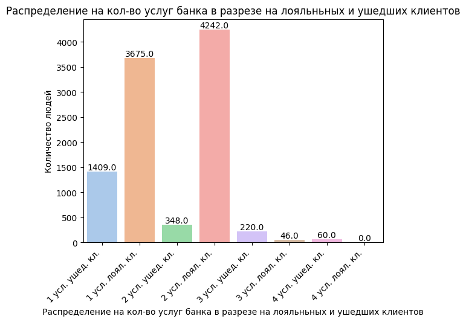

# Проект 1. Визуализация данных 

## Оглавление:

[1. Описание проекта](README.md#описание-проекта)  
[2. Какой кейс решаем?](README.md#какой-кейс-решаем)  
[3. Краткая информация о данных](README.md#краткая-информация-о-данных)  
[4. Этапы работы над проектом](README.md#этапы-работы-над-проектом)  
[5. Ссылка на репозиторий](README.md#ссылка-на-репозиторий)  
[6. Выводы](README.md#выводы)  

### Описание проекта

Проанализировать таблицу банка и выявить почему идет отток клиентов.  

### Какой кейс решаем?

* На поставленные вопросы составить график и заключение по увиденному результату; 
* Ответить и предположить, с чем может быть связан отток клиентов;
* В конце репозитория дать заключение по проделанной работе;
* Дать рекомендации по удержанию текущих клиентов;
* Дать рекомендации по привлечению новых клиентов.  
 

### Краткая информация о данных

Данные предстовляет собой файл формата *.csv*, в этом файле хранится следующая информация: 
1. В файле 10000 строк и 14 столбцов;
2. Пропущенных значений не было;
3. В файле имееются типы данных: float64(2), int64(9) и object(3);
4. Наименование столбцов таблицы:
* RowNumber — номер строки таблицы (это лишняя информация, поэтому можете сразу от неё избавиться);
* CustomerId — идентификатор клиента;
* Surname — фамилия клиента;
* CreditScore — кредитный рейтинг клиента (чем он выше, тем больше клиент брал кредитов и возвращал их);
* Geography — страна клиента (банк международный);
* Gender — пол клиента;
* Age — возраст клиента;
* Tenure — сколько лет клиент пользуется услугами банка;
* Balance — баланс на счетах клиента в банке;
* NumOfProducts — количество услуг банка, которые приобрёл клиент;
* HasCrCard — есть ли у клиента кредитная карта (1 — да, 0 — нет);
* IsActiveMember — есть ли у клиента статус активного клиента банка (1 — да, 0 — нет);
* EstimatedSalary — предполагаемая заработная плата клиента;
* Exited — статус лояльности (1 — ушедший клиент, 0 — лояльный клиент).
5. Вес файла 1.1+ MB

### Этапы работы над проектом

>Для решения данной задачи были применены следующие методы:
* Импорт библиотеки *pandas* для работы с табличными данными;
* Импорт библиотек для графической визуализации данных, такие как *seaborn*, *matplotlib.pyplot*, *plotly.express*;
1. Построение круговой диограммы для просмотра процента ушедших клиентов и лояльных. 

>Вывод: на графике отчетливо видно отток клиентов, который соответствует 20% 
2. Cтроим график, показывающий распределение баланса пользователей, у которых на счету больше 2 500 долларов. 

>Вывод: на графике видно, большая часть клиентов имеют баланс на счетах в диапазоне  от 100 до 150 тыс.дол. Распределение похоже на нормальное
3. Строим распределение баланса клиента в разрезе признака оттока. 

>Вывод: согласно графику, отчётливо видно, что большая часть клиентов покинули банк имея на счетах 0 долларов. Это может быть связано по двум причинам: 
>1. клиенты перевели все свои деньги в другое место и закрыли счет; 
>2. клиенты изначально не пользовались банком и со временем закрыли счета. 
>* Есть интересный момент, на который стоит обратить внимание банку, это то, что более 3000 человек имеют нулевой баланс и в любой момент они могут стать неактивными клиентами. 
4. Строим коробчатую диограмму распределения возраста в разрезе признака оттока.

>Вывод: из представленного графика видно, что основной поток ушедших клиентов находиться в разрезе от 38 до 52 лет, где 50% квантиль смещен к возрасту 45-46 лет. Данная группа людей имеют статус работающего человека и можно предположить, что у банка плохо развитая система с зарплатными картами или услуги банки не соответствуют ожиданиям работающего персонала.
5. Строим график, который показывает взаимосвязь кредитного рейтинга клиента и его предполагаемой зарплаты. Добавляем расцветку по признаку оттока клиентов. 

>Вывод: основанная масса ушедших клиентов на данном графике не понятно почему решила уйти. Но существует ряд клиентов, у которых низкий рейтинг банка который составляет 400, соответственно это те клиенты, которые вовремя не возвращают деньги банку. 
6. Строим график, который показывает кто чаще уходит, мужчины или женщины.

>Вывод: согласно графику, отчетливо видно, что ушедших женщин больше, чем мужчин. Также отчетливо видно, что мужчины больше пользуются услугами банка, чем женщины
7. Строим график, который показывает отток клиентов от числа приобретённых у банка услуг.

>Вывод: столбчатая диаграмма показывает зависимость ушедших клиентов к воспользовавшись услугами банка. Согласно статистике, все клиенты, которые пользовались 4-мя услугами банка, в итоге отказались от банка. Также большое количество клиентов отказываются от банка, которые имеют более 3-х услуг банка. Можно сделать вывод, что клиенты не справляются с взятыми на себя обязанностями. Также можно подчеркнуть, что банк плохо анализирует своих клиентов, потому что одобряет большее количество услуг.
8. Строим график влияния наличия статуса активного клиента на отток клиентов.

>Вывод: 

>1 Как влияет наличие статуса активного клиента на отток клиентов? - данный статус не влияет на уход клиента.

> 2 Что бы вы предложили банку, чтобы уменьшить отток клиентов среди неактивных? - чтобы поднять активность клиента, его необходимо вовлекать в процесс работы с банком, например:

> 2.1. установить малые игры, где за достижения определенных условий, клиент получит скидку или какой-нибудь повышенный кэшбек;

> 2.2. обучающие игры и опросники. Создай интерфейс помогающим людям подтягивать свои знания в области финансовой грамотности;

> 2.3. Делиться своими результатами с клиентами, например, банк достиг чего-то благодаря Вас и (бла, бла, бла);

> 2.4. Договориться с администрацией города и устраивать опросы, собирать пожертвования по улучшению города. Так каждый участник может видеть свой вклад в развитие общего дела. Такие же мероприятия можно осуществлять и с помощью больных людей и животных, которые попали в сложнейшую ситуацию. Банк выступает в роли организатора и гаранта денежных средств;

> 2.5. Постоянно общаться с клиентами и спрашивать их мнение о работе банка.
9. Строим тепловую картограмму и показываем в какой стране доля ушедших клиентов больше.

>Вывод: Согласно графику, видно, что большинство ушедших клиентов, это выходцы из Германии. 
10. 
* Создаем новый признак CreditScoreCat — категории кредитного рейтинга;
* Строим сводную таблицу, строками которой являются категории кредитного рейтинга (CreditScoreCat), а столбцами — количество лет, в течение которых клиент пользуется услугами банка (Tenure). В ячейках сводной таблицы находяться среднее по признаку оттока (Exited) — доля ушедших пользователей;
* На основе полученной сводной таблицы строим тепловую карту.

>Вывод: На тепловой карте отчетливо видно, что уходят клиенты:
>1.  у которых кредитный рейтинг является очень плохой 'very_poor' и они пользуются банком менее года.
>2. Следующая категория ушедших находятся на всей линии очень плохого рейтинга с годом использования банка от 1 до 10 лет. Это говорит о том, что за время пользования банкам, клиенты зарекомендовали себя как безответственные лица, а так как клиент не исправляет свой статус, он попросту уходит из банка. 
>3. Самый мало заметный признак, который не стоит отпускать из виду тех клиентов, у которых кредитный рейтинг высокий и пользуются они банком до года, 5 и 6 год и от 9 лет. Банку стоит пристально уделить внимание этим гражданам, так как это самые теплые клиенты и их уход из банка может пошатнуть сам рейтинг банка.

### Ссылка на репозиторий

Для ознакомпления с моим кодом, предлагаю перейти по сслыкам. Там Вы увидите все мои вопросы, коды, и выводы после каждой операции. Для Вашего удобства я разместил проект на двух источниках

1. [Ссылка на git hub](https://github.com/qv1k1/I_Win/blob/main/02%20%D0%9F%D1%80%D0%BE%D0%B5%D0%BA%D1%82%D1%8B/project_1/PYTHON-13.1.%20%D0%92%D0%B8%D0%B7%D1%83%D0%B0%D0%BB%D0%B8%D0%B7%D0%B0%D1%86%D0%B8%D1%8F%20%D0%B4%D0%B0%D0%BD%D0%BD%D1%8B%D1%85.ipynb)
2. [Ссылка на colab](https://colab.research.google.com/drive/1SF4eXxQcHlhZriLSzC1oogJU6jfEiyWc)

### Выводы

> Резюмируя всю работу хочется отметить следующее сегменты клиентов:
1. Потенциальные клиенты, которые уходят это лица, находящиеся в возрасте от 38 до 52 лет, в основном имеют не высокий рейтинг и изначально у них на счетах о долларов. Банку необходимо уделить четкое внимание на эту категорию людей.

2. Вторая категория лиц находятся в той же возрастной категории, но при этом имеют высокий рейтинг, и имеют суммы в банке. Данная категория, очень важна для банка, так как клиенты честны перед банком и все возвращают, но по каким-то причинам они уходят. Банку надо связываться с такими клиентами и с каждом в устном порядке работать, один такой клиент может привести не только деньги в банк и но и быть распространителем рекомендаций среди своего окружения, у которых на счетах могут быть такие же средние чеки в 100 тыс. долларов.

3. Данная категория, очень туманная. И я сейчас описываю лояльных клиентов, у которых на счетах 0 и их около 3 тыс. человек. Банку необходимо проработать с этой массой людей до тех пор, пока не стали ушедшими.

[К оглавлению](README.md#оглавление)