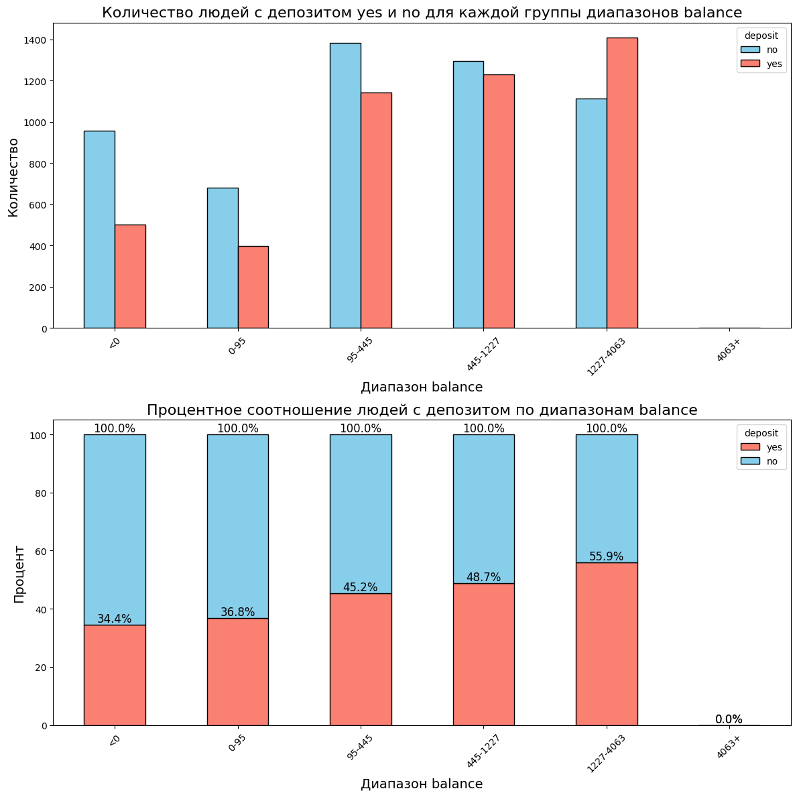
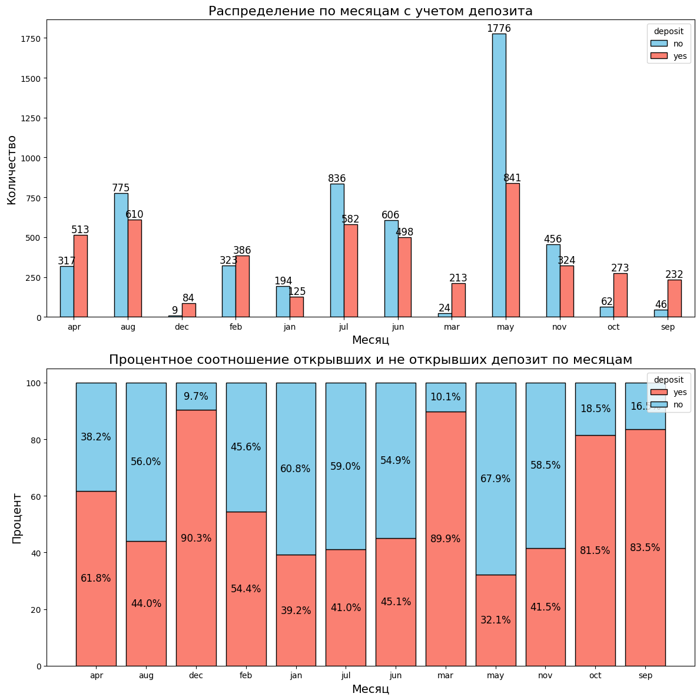
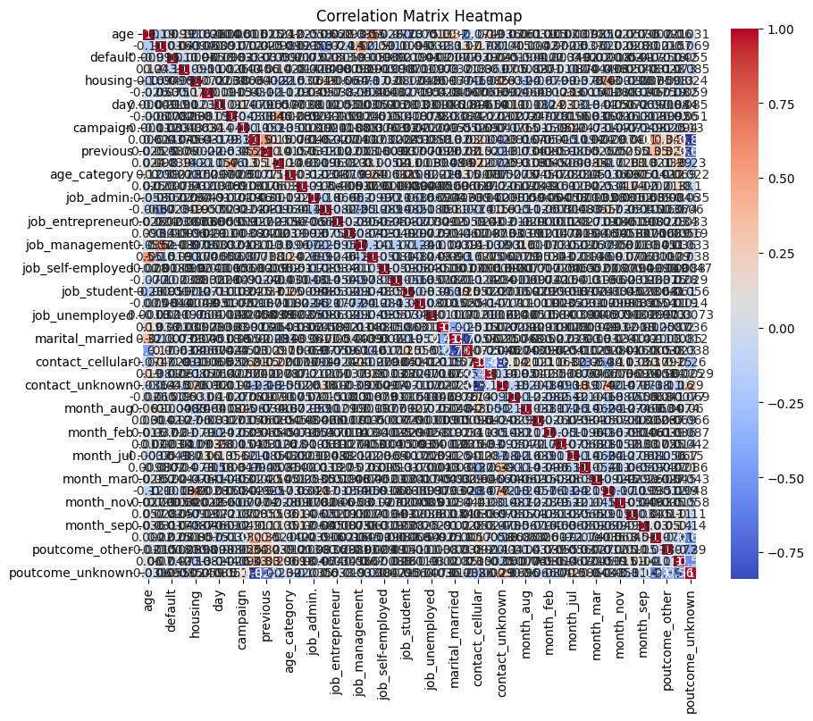

# Проект 10. Задача классификации


## Оглавление:

[1. Описание проекта](README.md#описание-проекта)  
[2. Какой кейс решаем?](README.md#какой-кейс-решаем)  
[3. Краткая информация о данных](README.md#краткая-информация-о-данных)  
[4. Этапы работы над проектом](README.md#этапы-работы-над-проектом)  
[5. Ссылка на репозиторий](README.md#ссылка-на-репозиторий)  
[6. Выводы](README.md#выводы)  


### Описание проекта

Банки хранят огромные объёмы информации о своих клиентах. Эти данные можно использовать для того, чтобы оставаться на связи с клиентами и индивидуально ориентировать их на подходящие именно им продукты или банковские предложения.

Обычно с выбранными клиентами связываются напрямую через разные каналы связи: лично (например, при визите в банк), по телефону, по электронной почте, в мессенджерах и так далее. Этот вид маркетинга называется прямым маркетингом. На самом деле, прямой маркетинг используется для взаимодействия с клиентами в большинстве банков и страховых компаний. Но, разумеется, проведение маркетинговых кампаний и взаимодействие с клиентами — это трудозатратно и дорого.

>→ Банкам хотелось бы уметь выбирать среди своих клиентов именно тех, которые с наибольшей вероятностью воспользуются тем или иным предложением, и связываться именно с ними.

Вам предоставили данные о последней маркетинговой кампании, которую проводил банк: задачей было привлечь клиентов для открытия депозита. Вы должны проанализировать эти данные, выявить закономерность и найти решающие факторы, повлиявшие на то, что клиент вложил деньги именно в этот банк. Если вы сможете это сделать, то поднимете доходы банка и поможете понять целевую аудиторию, которую необходимо привлекать путём рекламы и различных предложений.

**Бизнес-задача:** определить характеристики, по которым можно выявить клиентов, более склонных к открытию депозита в банке, и за счёт этого повысить результативность маркетинговой кампании.

**Техническая задача для вас как для специалиста в Data Science:** построить модель машинного обучения, которая на основе предложенных характеристик клиента будет предсказывать, воспользуется он предложением об открытии депозита или нет.

#### ОСНОВНЫЕ ЦЕЛИ:

1. Исследуйте данные, а не просто вычисляйте метрики и создавайте визуализации.
2. Попробуйте выявить характерные черты для потенциальных клиентов, чтобы чётко очертить ЦА и увеличить прибыль банка.
3. Проявляйте фантазию и используйте разные инструменты для повышения качества прогноза.

Данные представлены в формате [CSV](https://lms-cdn.skillfactory.ru/assets/courseware/v1/dab91dc74eb3cb684755123d224d262b/asset-v1:SkillFactory+DSPR-2.0+14JULY2021+type@asset+block/bank_fin.zip).  Каждая строка представляет молекулу. 


### Какой кейс решаем?

Проект будет состоять из пяти частей:

1. Первичная обработка данных

В рамках этой части вам предстоит обработать пропуски и выбросы в данных. Это необходимо для дальнейшей работы с ними.

2. Разведывательный анализ данных (EDA)

Вам необходимо будет исследовать данные, нащупать первые закономерности и выдвинуть гипотезы.

3. Отбор и преобразование признаков

На этом этапе вы перекодируете и преобразуете данные таким образом, чтобы их можно было использовать при решении задачи классификации. Если на первом этапе вы лишь избавите данные от ненужных артефактов, то на этом шаге совершите действия, более важные для подготовки данных к задаче классификации, уже понимая их структуру.

4. Решение задачи классификации: логистическая регрессия и решающие деревья

На данном этапе вы построите свою первую прогностическую модель и оцените её качество. Вы научитесь подбирать оптимальные параметры модели для того, чтобы получить наилучший результат для конкретного алгоритма.

5. Решение задачи классификации: ансамбли моделей и построение прогноза

На заключительном этапе вы сможете доработать своё предсказание с использованием более сложных алгоритмов и оценить, с помощью какой модели возможно сделать более качественные прогнозы.

### Краткая информация о данных

##### Данные о клиентах банка:

* age (возраст);
* job (сфера занятости);
* marital (семейное положение);
* education (уровень образования);
* default (имеется ли просроченный кредит);
* housing (имеется ли кредит на жильё);
* loan (имеется ли кредит на личные нужды);
* balance (баланс).

##### Данные, связанные с последним контактом в контексте текущей маркетинговой кампании:

* contact (тип контакта с клиентом);
* month (месяц, в котором был последний контакт);
* day (день, в который был последний контакт);
* duration (продолжительность контакта в секундах).

##### Прочие признаки:

* campaign (количество контактов с этим клиентом в течение текущей кампании);
* pdays (количество пропущенных дней с момента последней маркетинговой кампании до контакта в текущей кампании);
* previous (количество контактов до текущей кампании)
* poutcome (результат прошлой маркетинговой кампании).

И, разумеется, наша целевая переменная deposit, которая определяет, согласится ли клиент открыть депозит в банке. Именно её мы будем пытаться предсказать в данном кейсе.

### Этапы работы над проектом

>Для решения данной задачи были применены следующие этапы:

#### 1. Импорт библиотек:

* import pandas as pd # для анализа и предобработки данных
* import numpy as np # для матричных вычислений
* import matplotlib.pyplot as plt # для визуализации
* import seaborn as sns # для визуализации
* from sklearn.ensemble import IsolationForest # Изоляционный лес - алгоритм для выявления аномалий
* import warnings # Предупреждения для игнорирования ненужных предупреждений
* warnings.filterwarnings('ignore') # Фильтрация предупреждений
* from sklearn.preprocessing import LabelEncoder # Кодировщик меток - для преобразования категориальных признаков в числовые
* from sklearn import linear_model # Линейные модели
* from sklearn import tree # Деревья решений
* from sklearn import ensemble # Ансамблевые методы
* from sklearn import metrics # Метрики для оценки качества моделей
* from sklearn import preprocessing # Препроцессинг данных (нормализация, стандартизация и т.д.)
* from sklearn.model_selection import train_test_split # Разделение данных на обучающую и тестовую выборки
* from sklearn.feature_selection import SelectKBest, f_classif # Выбор признаков с использованием статистических методов
* from sklearn.preprocessing import MinMaxScaler # Масштабирование данных
* from sklearn.linear_model import LogisticRegression # Логистическая регрессия - метод для бинарной классификации
* from sklearn.metrics import accuracy_score # Оценка точности модели
* from sklearn.tree import DecisionTreeClassifier # Классификатор на основе дерева решений
* from sklearn.ensemble import RandomForestClassifier # Классификатор на основе случайного леса
* from sklearn.metrics import accuracy_score, recall_score # Оценка точности и полноты модели
* from sklearn.ensemble import GradientBoostingClassifier # Градиентный бустинг - ансамблевый метод
* from sklearn.ensemble import GradientBoostingClassifier, StackingClassifier # Стекинг классификаторов - ансамблевый метод для объединения нескольких моделей
* from sklearn.metrics import precision_score # Оценка точности модели
* import optuna # Optuna - библиотека для автоматической оптимизации гиперпараметров

#### 2. Знакомство с данными, обработка пропусков и выбросов

* Количество пропусков: balance      25
* Пропуски в ['job'], отображаются в виде unknown            70
* Заполнение пропусков медианным значением = ['balance'].median()
* обработываем пропуски в категориальных признаках: job и education, заменив их на модальные значения
* Число выбросов по методу Тьюки: 1057

#### 3. Разведывательный анализ

* Изучаем соотношение классов в данных на предмет несбалансированности


* Рассчитываем описательную статистику для категориальных переменных, проинтерпретируем результат


* Узнаtv, для какого статуса предыдущей маркетинговой кампании успех в текущей превалирует над количеством неудач.

deposit|	no|	yes
|--|--|--|		
failure|	562|	547
other|	216|	265
success|	84|	861
unknown|	4562|	3008

* узнаtv, в каком месяце чаще всего отказывались от предложения открыть депозит

deposit|	no|	yes
|--|--|--|
apr|	317|	513
aug|	775|	610
dec|	9|	84
feb|	323|	386
jan|	194|	125
jul|	836|	582
jun|	606|	498
mar| 24|	213
may|	1776|	841
nov|	456|	324
oct|	62|	273
sep|	46|	232

*  создаем возрастные группы и определяем, в каких группах более склонны открывать депозит, чем отказываться от предложения


#### 3.1. Разведывательный анализ каждого признака

#####  job


Если смотреть на грфик, то сначала будем отмечать, те проффессии, которые имеют больший поенциал для нас в будущем, а это:
 

Имя | Процент | МСН
|--|--|--|
student | 75.2% | H
retired | 65.2% | C
unemployed | 56.9% | H
management | 49.0% | M


*мсн - много, среднее, н (мало) - количество людей в самой должности по отношению у другим профессиям

Далее я пока не буду расписывать. Возьму эти 4 группы для дальнейшего подбора в сфере поиска уникального клиента для депозита. Были взяты текущие профессии по причине их большего влияния в % эквиваленте. 

Есть визуализационная закономерность, когда банк работает с одной из групп в большей части, то большая его клиентов оказываются без депозита. Соотвенно группы для анализа взяты те, что меньше состовляют по количеству и в дальнейшем надеюсь найти ту саммую группу, на которую банку стоит акцентировать внимание. 

##### balance



balance - следующий признак 

Имя | Процент | MCH
|--|--|--|
1227-4063 | 55.9% | M

Берем одну категорию, так как во всех остальных случаев приоблодает больше отказов, чем положителных депозитов


##### marital

marital - следующий признак 

Имя | Процент | MCH
|--|--|--|
single | 53.4% | C

Берем одну категорию, так как во всех остальных случаев приоблодает больше отказов, чем положителных депозитов

##### education


education - следующий признак 

Имя | Процент | MCH
|--|--|--|
tertiary | 52.9% | C

Берем одну категорию, так как во всех остальных случаев приоблодает больше отказов, чем положителных депозитов

##### default


default - следующий признак 

Имя | Процент | MCH
|--|--|--|
no | 46.6% | M

Берем одну категорию, так как во всех остальных случаев приоблодает больше отказов, чем положителных депозитов

##### housing


housing - следующий признак 

Имя | Процент | MCH
|--|--|--|
no | 53.9% | C

Берем одну категорию, так как во всех остальных случаев приоблодает больше отказов, чем положителных депозитов

##### loan


loan - следующий признак 

Имя | Процент | MCH
|--|--|--|
no | 48.5% | M

Берем одну категорию, так как во всех остальных случаев приоблодает больше отказов, чем положителных депозитов

##### contact


contact - следующий признак 

Имя | Процент | MCH
|--|--|--|
cellular | 53.3% | M

Берем одну категорию, так как во всех остальных случаев приоблодает больше отказов, чем положителных депозитов

##### month



month - следующий признак 

Имя | Процент | MCH
|--|--|--|
dec | 90.3% | H
mar | 89.9% | H
oct | 81.5% | H
sep | 83.5% | H
apr | 61.8% | C
feb | 54.4% | H

Берем шесть категорий, так как во всех остальных случаев приоблодает больше отказов, чем положителных депозитов

##### poutcome


poutcome - следующий признак 

Имя | Процент | MCH
|--|--|--|
success | 91.1% | H
mar | 55.1% | H
failure | 49.3% | H


Берем три категории, так как во всех остальных случаев приоблодает больше отказов, чем положителных депозитов

##### age_category


age_category - следующий признак 

Имя | Процент | MCH
|--|--|--|
60+ | 76.0% | H
<30 | 59.2% | c

Берем две категории, так как во всех остальных случаев приоблодает больше отказов, чем положителных депозитов

##### day


day - следующий признак 

Имя | Процент | MCH
|--|--|--|
9-15 | 50.9% | C
1-8 | 48.4% | C

Берем две категории, так как во всех остальных случаев приоблодает больше отказов, чем положителных депозитов

##### duration


duration - следующий признак 

Имя | Процент | MCH
|--|--|--|
490+ | 82.0% | C
252-490 | 54.7% | C

Берем две категории, так как во всех остальных случаев приоблодает больше отказов, чем положителных депозитов

##### campaign


campaign - следующий признак 

Имя | Процент | MCH
|--|--|--|
2 | 45.8% | C
1 | 45.3% | M

Берем две категории, так как во всех остальных случаев приоблодает больше отказов, чем положителных депозитов

##### pdays


pdays - следующий признак 

Имя | Процент | MCH
|--|--|--|
-1-200 | 74.8% | M

Берем одну категорию, так как во всех остальных случаев приоблодает больше отказов, чем положителных депозитов

##### previous


previous - следующий признак 

Имя | Процент | MCH
|--|--|--|
4-10 | 70.2% | H
2-3 | 65.6% | H
1 | 64.4% | H 

Берем три категории, так как во всех остальных случаев приоблодает больше отказов, чем положителных депозитов

##### Общий вывод : 

* Фильтрация данных по нескольким признакам
filtered_df = df[
    (df['poutcome'] == 'success') &
    (df['month'].isin(['dec', 'mar', 'oct', 'sep'])) &
    (df['duration'].between(490, 3881))
]

Лучше всего банку акцентировать свою новую рекламную компанию в таких месецах как март, октябрь и декабрь, где в прошлый раз был успех и продолжительность контакта от 490 до 3881 секунду.

* построим сводную таблицу, чтобы определить люди с каким образованием и семейным статусом наиболее многочисленны


#### 4. Преобразование данных

* преобразовываем уровни образования

df['education'] = LabelEncoder().fit_transform(df['education'])

* преобразовываем уровень возраста

df['age_category'] = LabelEncoder().fit_transform(df['age_category'])

* создаю dummy-переменных

df = pd.get_dummies(df, columns=['job', 'marital', 'contact', 'month', 'poutcome'])

* строю корреляционную матрицу и оцениваю данные на предмет наличия мультиколлинеарности




* рассчитываем необходимые показатели: Среднее значение целевой переменной на тестовой выборке после нормализации: 0.47

* с помощью SelectKBest отбираю 15 наиболее подходящих признаков - Index(['balance', 'housing', 'duration', 'campaign', 'pdays', 'previous',
       'age_category', 'contact_cellular', 'contact_unknown', 'month_mar',
       'month_may', 'month_oct', 'month_sep', 'poutcome_success',
       'poutcome_unknown'],
      dtype='object')

#### 5. Решение задачи классификации: логистическая регрессия и решающие деревья

* обучил логистическую регрессию и рассчитал метрики качества - Accuracy модели логистической регрессии на тестовой выборке: 0.83
* обучил решающие деревья, настроил максимальную глубину

Accuracy модели решающих деревьев на тестовой выборке: 0.75

Оптимальная глубина дерева: 6

Accuracy на тестовой выборке для оптимальной глубины дерева: 0.8


* подобрал оптимальные параметры с помощью gridsearch

Лучшие параметры: {'max_depth': 7, 'min_samples_split': 10}

F1 метрика на тестовой выборке для наилучшей комбинации параметров: 0.78

# 6. Решение задачи классификации: ансамбли моделей и построение прогноза

* обучил случайный лес на своих данных 

Accuracy модели случайного леса на тестовой выборке: 0.83

Recall модели случайного леса на тестовой выборке: 0.84

* использовал для классификации градиентный бустинг и сравнил качество со случайным лесом

F1 метрика на тестовой выборке для модели градиентного бустинга: 0.82

Какая модель даёт более качественный прогноз (если посмотреть известные вам метрики в целом)?

 ```Случайный лес```

* объединил уже известные алгоритмы с помощью стекинга

Precision модели стекинга на тестовой выборке: 0.8

* оценил, какие признаки демонстрируют наибольшую  важность в модели градиентного бустинга

Три наиболее значимых признака:

num| Feature | Importance
|--|--|--|
2   |        duration |   0.503805
13 | poutcome_success  |  0.115602
8   | contact_unknown  |  0.075658

* реализовал оптимизацию гиперпараметров с помощью Optuna

Лучшие гиперпараметры:  {'n_estimators': 100, 'max_depth': 26, 'min_samples_leaf': 4}

F1 на тестовой выборке: 0.83

Accuracy на тестовой выборке: 0.83

#### 7. Вывод:

В первом блоке выявили пропуски и избавились от них; 
во втором блоке 
* исследовать данные;
* попробовать найти закономерности, позволяющие сформулировать предварительные гипотезы относительно того, какие факторы являются решающими для оформления депозита;
* дополнить ваш анализ визуализациями, иллюстрирующими ваше исследование. Постарайтесь оформлять диаграммы с душой, а не «для галочки»: навыки визуализации полученных выводов обязательно пригодятся вам в будущем.

В третьем блоке 
* Следует помнить, что алгоритмы машинного обучения не могут обрабатывать категориальные признаки в их обычном виде. По ходу работы алгоритм считает показатели (например, средние значения), которые можно вычислить только для количественных признаков. Поэтому нам необходимо преобразовать категориальные признаки в более удобный формат.
* Необходимо масштабировать и трансформировать некоторые признаки для того, чтобы улучшить качество модели.
* Надо отобрать признаки, которые мы будем использовать для обучения модели.

В четвертом блоке 

Для начала реализуем самый простой алгоритм, который вам известен — логистическую регрессию. В качестве алгоритма оптимизации будем использовать 'sag', в качестве значения параметра random_state возьмём число 42 и запустим 1000 итераций.

В пятом блоке 

Вы уже смогли обучить несложные модели, и теперь пришло время усложнить их, а также посмотреть, улучшится ли результат (если да, то насколько). Вы обучили решающие деревья, и теперь пришла пора объединить их в случайный лес.


* RandomForestClassifier с RandomizedSearchCV показал наилучшие результаты по F1-метрике (0.83):

Этот метод также показал высокую точность (0.80), что делает его предпочтительным выбором для задач, где важна точная классификация и балансировка классов.

* RandomForestClassifier с GridSearchCV также показал хорошие результаты:

Модель показала точность 0.80 и F1-метрику 0.82. GridSearchCV выполняет исчерпывающий поиск по пространству гиперпараметров, что приводит к хорошим результатам, но это может занять больше времени по сравнению с RandomizedSearchCV.

* Hyperopt продемонстрировал самую высокую точность (0.81):

Хотя F1-метрика немного ниже (0.80), использование Hyperopt для автоматической оптимизации гиперпараметров показало себя весьма эффективным.

* Optuna показала стабильные результаты:

Optuna продемонстрировала высокую точность (0.80) и F1-метрику (0.80), что делает её хорошим инструментом для оптимизации гиперпараметров, особенно учитывая её возможности для параллельной и распределённой оптимизации.

* DecisionTreeClassifier показывает более низкие результаты по сравнению с RandomForestClassifier:

RandomizedSearchCV для DecisionTreeClassifier показал точность 0.76 и F1-метрику 0.78, что выше, чем при использовании GridSearchCV (точность 0.75 и F1-метрика 0.75). Это подтверждает, что случайный поиск может быть более эффективным для деревьев решений.


### Ссылка на репозиторий

Для просмотра кода, предлагаю перейти по сслыкам. 

1. [Ссылка на git hub](https://github.com/qv1k1/I_Win/blob/main/02%20%D0%9F%D1%80%D0%BE%D0%B5%D0%BA%D1%82%D1%8B/project_9/ML-7.%20%20%D0%9F%D1%80%D0%B0%D0%BA%D1%82%D0%B8%D0%BA%D0%B0.ipynb)
2. [Ссылка на colab](https://colab.research.google.com/drive/1oesXokqTPusIf6gv0-vdlaphg4yKi8Bl?usp=sharing)


### Выводы

> Вся работа была разбита на 6 блоков:
* Импорт библиотек;
* Расчет модлей логистической регрессии;
* Расчет модели дерева решений;
* Расчет модели Hyperopt;
* Расчет модели Optuna;
* Вывод. 

В первом блоке мы импортировали библиотеки, которые использовались в процессе работы для более корректного анализа данных;

Со второго блока по пятый блок был произвден расчет модлей по собственным параметрам;

В шестом блоке, отображены выводы по каждому вопросу. 

Работа проделана большая, данные можно использовать для предсказывание биологических молекул по их химическому сосставу 

[К оглавлению](README.md#оглавление)