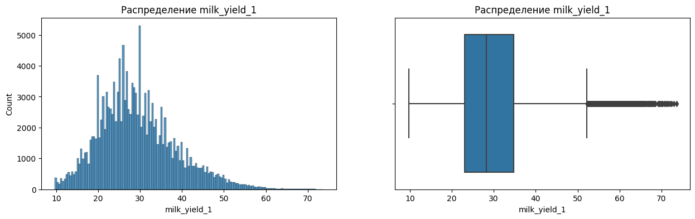

# Проект 11. Прогноз продуктивности животных

## Оглавление:

[1. Описание проекта](README.md#описание-проекта)  
[2. Какой кейс решаем?](README.md#какой-кейс-решаем)  
[3. Краткая информация о данных](README.md#краткая-информация-о-данных)  
[4. Этапы работы над проектом](README.md#этапы-работы-над-проектом)  
[5. Ссылка на репозиторий](README.md#ссылка-на-репозиторий)  
[6. Выводы](README.md#выводы)  

### Описание проекта

В процессах принятий решений на молочных фермах одним из важных показателей является прогноз продуктивности животных,
который необходим для отбора животных для последующего осеменения или выбраковки. 

Если модель сможет точно предсказывать продуктивность животных (удой молока), это поможет увеличить производительность
фермы и уменьшить затраты на содержание животных.

В качестве измерения удоя животных часто выступают `контрольные дойки` -- замер суточного надоя каждого животного раз в
месяц в течение всей лактации. 

#### ОСНОВНЫЕ ЦЕЛИ:

Задача состоит в том, чтобы на основе данных 
- о контрольных дойках коров;
- и родословных 
  
Создать модель, которая сможет предсказывать продуктивность каждого животного в последующих месяцах.

### Какой кейс решаем?

Проект будет состоять из пяти частей:

1. Первичная обработка данных

В рамках этой части вам предстоит обработать пропуски и выбросы в данных. Это необходимо для дальнейшей работы с ними.

2. Разведывательный анализ данных (EDA)

Вам необходимо будет исследовать данные, нащупать первые закономерности и выдвинуть гипотезы.

3. Отбор и преобразование признаков

На этом этапе вы перекодируете и преобразуете данные таким образом, чтобы их можно было использовать при решении задачи классификации. Если на первом этапе вы лишь избавите данные от ненужных артефактов, то на этом шаге совершите действия, более важные для подготовки данных к задаче классификации, уже понимая их структуру.

4. Определить метрику качества 

Метрикой качества является RMSE между данными к контрольным дойкам с 3-ей по 10-ю (для тех контрольных доек, где данные
известны) и их прогнозом

### Краткая информация о данных

#### Таблица 1. Родословная - predige.csv

| Колонка	  | Описание      |
| ---------- | ------------- |
| animal_id  | ID животного  |
| mother_id  | ID матери     |
| father_id  | ID отца       |

#### Таблица 2. Контрольные дойки - train.csv

| Колонка	       | Описание                                                             | Таргет |
| ---------------- | -------------------------------------------------------------------- | ------ | 
| animal_id        | ID животного                                                         |        |
| lactation        | Номер лактации                                                       |        |
| calving_date     | Дата начала лактации                                                 |        |
| farm             | Ферма                                                                |        |
| farmgroup	       | Хозяйство (группа из ферм)                                           |        |
| birth_date       | Дата рождения животного                                              |        |
| milk_yield_1     | Контрольная дойка (удой за 1 день) в 1 месяце после начала лактации  |        |
| milk_yield_2     | Контрольная дойка (удой за 1 день) в 2 месяце после начала лактации  |        |
| milk_yield_3     | Контрольная дойка (удой за 1 день) в 3 месяце после начала лактации  | X      |
| milk_yield_4     | Контрольная дойка (удой за 1 день) в 4 месяце после начала лактации  | X      |
| milk_yield_5     | Контрольная дойка (удой за 1 день) в 5 месяце после начала лактации  | X      |
| milk_yield_6     | Контрольная дойка (удой за 1 день) в 6 месяце после начала лактации  | X      |
| milk_yield_7     | Контрольная дойка (удой за 1 день) в 7 месяце после начала лактации  | X      |
| milk_yield_8     | Контрольная дойка (удой за 1 день) в 8 месяце после начала лактации  | X      |
| milk_yield_9     | Контрольная дойка (удой за 1 день) в 9 месяце после начала лактации  | X      |
| milk_yield_10    | Контрольная дойка (удой за 1 день) в 10 месяце после начала лактации | X      |

#### Таблица 3. Тестовый датаест - X_test_public.csv

| Колонка	       | Описание                                                             | Таргет |
| ---------------- | -------------------------------------------------------------------- | ------ | 
| animal_id        | ID животного                                                         |        |
| lactation        | Номер лактации                                                       |        |
| calving_date     | Дата начала лактации                                                 |        |
| farm             | Ферма                                                                |        |
| farmgroup	       | Хозяйство (группа из ферм)                                           |        |
| birth_date       | Дата рождения животного                                              |        |
| milk_yield_1     | Контрольная дойка (удой за 1 день) в 1 месяце после начала лактации  |        |
| milk_yield_2     | Контрольная дойка (удой за 1 день) в 2 месяце после начала лактации  |        |

#### Таблица 4. Формат датафрейма прогноза, который должен быть возвращен функцией predict() 

| Колонка	       | Описание                                                             | Таргет |
| ---------------- | -------------------------------------------------------------------- | ------ | 
| animal_id        | ID животного                                                         |        |
| lactation        | Номер лактации                                                       |        |
| milk_yield_3     | Контрольная дойка (удой за 1 день) в 3 месяце после начала лактации  | X      |
| milk_yield_4     | Контрольная дойка (удой за 1 день) в 4 месяце после начала лактации  | X      |
| milk_yield_5     | Контрольная дойка (удой за 1 день) в 5 месяце после начала лактации  | X      |
| milk_yield_6     | Контрольная дойка (удой за 1 день) в 6 месяце после начала лактации  | X      |
| milk_yield_7     | Контрольная дойка (удой за 1 день) в 7 месяце после начала лактации  | X      |
| milk_yield_8     | Контрольная дойка (удой за 1 день) в 8 месяце после начала лактации  | X      |
| milk_yield_9     | Контрольная дойка (удой за 1 день) в 9 месяце после начала лактации  | X      |
| milk_yield_10    | Контрольная дойка (удой за 1 день) в 10 месяце после начала лактации | X      |

### Этапы работы над проектом

>Для решения данной задачи были применены следующие этапы:

#### 1. Импорт библиотек:

* import pandas as pd # для анализа и предобработки данных
* import numpy as np # для матричных вычислений
* import matplotlib.pyplot as plt # для визуализации
* import seaborn as sns # для визуализации
* from sklearn.ensemble import IsolationForest # Изоляционный лес - алгоритм для выявления аномалий
* import warnings # Предупреждения для игнорирования ненужных предупреждений
* warnings.filterwarnings('ignore') # Фильтрация предупреждений
* from sklearn.preprocessing import LabelEncoder # Кодировщик меток - для преобразования категориальных признаков в числовые
* from sklearn import linear_model # Линейные модели
* from sklearn import tree # Деревья решений
* from sklearn import ensemble # Ансамблевые методы
* from sklearn import metrics # Метрики для оценки качества моделей
* from sklearn import preprocessing # Препроцессинг данных (нормализация, стандартизация и т.д.)
* from sklearn.model_selection import train_test_split # Разделение данных на обучающую и тестовую выборки
* from sklearn.feature_selection import SelectKBest, f_classif # Выбор признаков с использованием статистических методов
* from sklearn.preprocessing import MinMaxScaler # Масштабирование данных
* from sklearn.linear_model import LogisticRegression # Логистическая регрессия - метод для бинарной классификации
* from sklearn.metrics import accuracy_score # Оценка точности модели
* from sklearn.tree import DecisionTreeClassifier # Классификатор на основе дерева решений
* from sklearn.ensemble import RandomForestClassifier # Классификатор на основе случайного леса
* from sklearn.metrics import accuracy_score, recall_score # Оценка точности и полноты модели
* from sklearn.ensemble import GradientBoostingClassifier # Градиентный бустинг - ансамблевый метод
* from sklearn.ensemble import GradientBoostingClassifier, StackingClassifier # Стекинг классификаторов - ансамблевый метод для объединения нескольких моделей
* from sklearn.metrics import precision_score # Оценка точности модели
* import optuna # Optuna - библиотека для автоматической оптимизации гиперпараметров

#### 2. Знакомство с данными, обработка пропусков и выбросов

* Количество дубликатов: 0
* Количество пропусков в каждом столбце:

имя | кол-во
|--|--|
milk_yield_3   |   4507
milk_yield_4    |  3941
   milk_yield_5 |     4118
   milk_yield_6  |    5202
 milk_yield_7     | 4637
 milk_yield_8      |4510
 milk_yield_9 |     7695
 milk_yield_10 |   29396
mother_id        | 1764
father_id         | 298

#### 3. Разведывательный анализ

* Знакомлюсь с признаком lactation

Вывод: Понял. Всего 4 лактации у коров и у всех коров есть первая лактация но с каждой последующей лактацией, коровы ражали реже 

* Знакомлюсь с признаком farmgroup

Вывод: Распределив признак farmgroup на группы, увидел, что в целом у хозяйств близкое значение по количетсву животных

* Знакомлюсь с признаком farm

Вывод: Распределив признак farm на группы, увидел, что в целом у ферм близкое значение по количетсву животных

#### 4. Отбор и преобразование признаков

##### Признак  milk_yield_1

##### Признак  milk_yield_2

##### Признак  milk_yield_3

##### Признак  milk_yield_4

##### Признак  milk_yield_5

##### Признак  milk_yield_6

##### Признак  milk_yield_7

##### Признак  milk_yield_8

##### Признак  milk_yield_9

##### Признак  milk_yield_10

##### Общий вывод : 

Общий вывод по всем milk_yield: у всех были выбросы и после обработки еще остались, но сами числы стали более похаидть на правду, а значит такие значения можно оставлять.

##### Создал родословный признак 

Суть его заключается в том, чтобы увидеть поколение коров и зная, что некоторые коровы могут иметь несколько поколений, определить как это влияет на продукто который они выдают. 

Вывод: отлично теперь у меня есть новый признак generation, который даст мне возможность увидеть поколение коров и на основе поколения сделать предсказания по замерным дойкам 

#### 4. Преобразование данных

* Преобразвал дату
df['calving_date'] = pd.to_datetime(df['calving_date'])
df['birth_date'] = pd.to_datetime(df['birth_date'])

* преобразовываю признаки для обучения

encoder = LabelEncoder()
for col in ['animal_id', 'farm', 'mother_id', 'father_id', 'calving_season', 'birth_season', 'farm_farmgroup']:

* Корреляционный график

* Влияющие признаки на данные на примере milk_yield_3

#### 5. Определить метрику качества

* Среднее значение RMSE: 5.38375
* Стандартное отклонение RMSE: 11.1167145843457

Высокое стандартное отклонение RMSE указывает на нестабильность предсказаний модели, что является серьезным сигналом о необходимости дальнейшего улучшения модели. 

#### 7. Вывод:

* В первом блоке, импортировали все необходимые для работы библиотеки и прочили данные 
* Во втором блоке выявили пропуски и избавились от них; 
* В третьем блоке 
    1. исследовал  данные;
    2.  попробовал найти закономерности, позволяющие сформулировать предварительные гипотезы относительно того, какие факторы являются решающими;
    3. дополнил анализ визуализациями, иллюстрирующими исследование. 
    4. Постарался оформить диаграммы с душой, а не «для галочки».
* В четвертом блоке 
    1. Масштабировал и трансформировал некоторые признаки для того, чтобы улучшить качество модели.
    2. Отобрал признаки, которые будем использовать для обучения модели.
* В пятом блоке, расчитал метрику RMSE для каждого удоя и затем вывил средние  по всем удоям. Для того, чтобы определить оибку сравнил полученный показатель RMSE с показателем STD RMSE, где отклонение составило в половину, а полученные значения смущают. 

### Ссылка на репозиторий

Для просмотра кода, предлагаю перейти по сслыкам. 

1. [Ссылка на git hub](https://github.com/qv1k1/I_Win/blob/main/02%20%D0%9F%D1%80%D0%BE%D0%B5%D0%BA%D1%82%D1%8B/project_10/Project_4_ML.ipynb)
2. [Ссылка на colab](https://colab.research.google.com/drive/1-mDozFAwDzVQuwsvAL3Gw0yfh4jneI7i?usp=sharing)

### Выводы

> Вся работа была разбита на 7 блоков:
* Импорт библиотек;
* Знакомство с данными, обработка пропусков и выбросов;
* Разведывательный анализ;
* Преобразование данных;
* Решение задачи классификации: логистическая регрессия;
* Вывод.

В первом блоке: Импортирова библиотеки предоставляет необходимые инструменты для анализа данных, обработки, визуализации и моделирования. Используемые библиотеки включают pandas, numpy, matplotlib, seaborn, scikit-learn и другие.

Во вторм блоке осуществил: 
* Первичный осмотр данных позволяет понять их структуру и содержимое.

В третьем блоке осуществил: 
* Визуализация распределений переменных позволяет выявить их основные характеристики и выявить возможные аномалии.
* Исследование корреляций между переменными помогает понять взаимосвязи и выбрать наиболее важные признаки для моделирования.
* Визуализация распределения целевой переменной предоставляет информацию о балансе классов, что важно для выбора методов классификации.

В четвертом блоке: 
* Преобразование категориальных переменных в числовые форматы, такие как label encoding, делает их пригодными для использования в алгоритмах машинного обучения.

В пятом блоке: 
* Логистическая регрессия предоставляет интерпретируемую модель с коэффициентами, показывающими влияние каждого признака на вероятность класса.
* Решающие деревья легко интерпретировать и они способны моделировать нелинейные зависимости, но могут переобучаться на данных.

Проделана большая работа и можно с увереностью ответить какие признаки влияют на количество получаемой меры в замер контрольной дойки. 

[К оглавлению](README.md#оглавление)