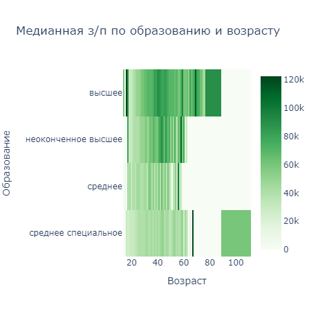

# Проект 2. Аналитик в компании HeadHunter 

## Оглавление:

[1. Описание проекта](README_pr2.md#описание-проекта)  
[2. Какой кейс решаем?](README_pr2.md#какой-кейс-решаем)  
[3. Краткая информация о данных](README_pr2.md#краткая-информация-о-данных)  
[4. Этапы работы над проектом](README_pr2.md#этапы-работы-над-проектом)  
[5. Ссылка на репозиторий](README_pr2.md#ссылка-на-репозиторий)  
[6. Выводы](README_pr2.md#выводы)  

### Описание проекта

В вашем распоряжении будет база резюме, выгруженная с сайта поиска вакансий hh.ru.

> Файл с исходными данными вы можете скачать [здесь](https://drive.google.com/file/d/1Kb78mAWYKcYlellTGhIjPI-bCcKbGuTn/view?usp=sharing).

Проблематика: часть соискателей не указывает желаемую заработную плату, когда составляет своё резюме.

### Какой кейс решаем?

>* Внимательно изучить детали задачи.
>* Скачать уже знакомый [датасет](https://drive.google.com/file/d/1Kb78mAWYKcYlellTGhIjPI-bCcKbGuTn/view?usp=sharing) и [ноутбук-шаблон](https://lms-cdn.skillfactory.ru/assets/courseware/v1/1577d067038f8073197105c174f05822/asset-v1:SkillFactory+DSPR-2.0+14JULY2021+type@asset+block/Project-1._%D0%9D%D0%BE%D1%83%D1%82%D0%B1%D1%83%D0%BA-%D1%88%D0%B0%D0%B1%D0%BB%D0%BE%D0%BD.ipynb).
>* Обязательно ознакомиться с дополнительным теоретическим материалом, который даётся перед заданием.
>* Воспользоваться нашими советами и подсказками при выполнении проекта.
>* Ответить на все контрольные вопросы: за них вы можете максимально **набрать 30 баллов на платформе**.
>* Загрузить ноутбук со своим решением на GitHub, оформив его в соответствии с требованиями.
>* Сдать проект на проверку и **получить 10 баллов** (из них 8 баллов — за основное задание и 2 балла — за дополнительное) за выводы по разведывательному анализу.
>* Получить обратную связь от команды курса. 

### Краткая информация о данных

1. Часть соискателей не указывает желаемую з/п, когда составляют свое резюме;
2. Размерность таблицы: 44744 число строк, 12 число столбцов;
3. Наимнование столбцов: 
    * Пол, возраст - тип данных (object);
    * ЗП - object;
    * Ищет работу на должность - object;
    * Город, переезд, командировки - object;
    * Занятость - object;
    * График - object;
    * Опыт работы - object;
    * Последнее/нынешнее место работы - object;
    * Последняя/нынешняя должность - object; 
    * Образование и ВУЗ - object; 
    * Обновление резюме - object;
    * Авто - object.
4. Вес документа - 4.1+ MB

### Этапы работы над проектом

>Для решения данной задачи были применены следующие этапы:
1. Импорт библиотек:
    * Pandas - работа с таблицами;
    * Numpy - для работы с математическими числами;
    * matplotlib.pyplot - работа с графиками;
    * seaborn - работа с графиками;
    * plotly.express - работа с графиками.
2. Базовый анализ структуры данных;
    * В столбцах: *Опыт работы*, *Последнее/нынешнее место работы* и *Последняя/нынешняя должность* - имеются пропуски;
    * Самая популярная должность в колонке *Ищет работу на должность* - *Системный администратор*.
3. Преоброзование данных;
    * Признак *Образование и ВУЗ* его текущий формат: *Уровень образования год выпуска ВУЗ специальность...*. Создал 4 отдельных признака, такие как: *высшее*, *неоконченное высшее*, *среднее специальное* и *среднее*;
    * Признак *Пол, возраст* его текущий формат: *Пол , возраст , дата рождения*. Создал 2 отдельных признака, такие как: *Пол* и *Возраст*;
    * Признак *Опыт работы* его текущий формат: *Опыт работы: n лет m месяцев, периоды работы в различных компаниях…*. Создал 1 отдельный признак: *Опыт работы (месяц)*;
    * Признак *Город, переезд, командировки* его текущий формат: *Город , (метро) , готовность к переезду (города для переезда) , готовность к командировкам*. Создал 3 отдельных признака, такие как: *Город*, *Готовность к переезду* и *Готовность к командировкам*;
    * Теперь расматриваем два признака *Занятость* и *График* его текущий формат: *полная занятость, частичная занятость, проектная работа, волонтерство, стажировка* и *полный день, сменный график, гибкий график, удаленная работа, вахтовый метод*. Создал 10 отдельных признаков разделив все значения в каждую отдельную категорию;
    * Признак *ЗП* его текущий формат: *30000 руб*, *50000 грн*, *550 USD* и т.д.. Создал признак с единой валютой (руб.).
4. Разведывательный анализ;

4.1.  Строю распределение признака *Возраст*.

>Вывод:
>* Большинство соискателей находятся в возрасте 27 и до 36 лет;
>* Предельные значения в признаке находятся в диапозоне от 14 лет до 36 лет;
>* Анамали в таблице присутсвуют и они проявляются с 50 лет и выше;
>* Модальное значение возраста сосискателей составляет 30 лет.

4.2. Строю распределение признака *Опыт работы (месяц)*.

>Вывод: 
>* Мода в данном графике равна 3.17;
>* Предельные значения в признаке равны от 1 до 299 месяца;
>* Большинства соискателей находятся в диапозоне 57 - 154 месяцев;
>* Выбрысы начинаются от 300 месяцев и до 1188 месяца.
 
4.3. Строю распределение признака *ЗП (руб)*.

>Вывод:
>* 5 соискателей хотят зарплату больше 1 млн. руб;
>* Мода в распределении равна 59 тыс. руб; 
>* Предельные значения в признаке равны от 1 до 180 тыс. руб;
>* Большинства соискателей хотят зарплату от 37 до 95 тыс. руб;
>* Выбрысы начинаются с зарплаты в 182 тыс.руб и предел воображения доходит до отметки в 24304 тыс. руб.

4.4. Строю распределение признака *ЗП (руб)* от *Образование*.

>Вывод:
>* У лиц которые имеют высшее оброзование желаемая заработная плата находится выше по отношению к другим лицам;
>* Из графика отчетливо видно, чем выше уровень оброзования, тем выше их предпочтения по зарплате;
>* Наверно для решения задачи, верно утверждать, что уровень оброзования важен. Но, все же я больше отношу предпочтения не уровню оброзования а его наличии. Взять пример школы "SF", по окончании я не получу диплом о высшем оброзовании, получу только сертификат. Но, знания, которые тут можно приобрести куда намного сильней будут цениться, чем наличие высшее оброзования. Ответом для меня будет таков: наличие оброзования имеет один из пунктов при подборе персонала, но не самым важным. 

4.5. Строю распределение признака *ЗП (руб)* от *Город*.

>Вывод:
>* Согласно графику можно отметить следующее: 
    >1. Показатель моды у городов миллиоников и осальных городов он равен 40 тыс.руб. и размах желаемый з/п тоже равен. Это говрит о том, что конкурецния внутри этих двух городов проходит на равном уровне от сюда и показатели схожи;
    >2. Далее город Санк-Петербург с небольшим отрывом начинает превосходить первую категорию, где мода равна 60 тыс.руб; 
    >3. Лидером анализа становится Москва, у которой мода равняется 85 тыс.руб.
    >* От сюда хочетса сделать вывод, что между городами с населением 1 млн. чел. и меньше уровень зарплат схожий, а в городах по типу населении Санкт-Петербурга и Москвы, где соотвественно население 7 и 15 млн.чел. уровень зарплаты в рззы больше по отношению к первой категории. 
>* Я считаю, что важен город при прогнозировании зарплаты, т.к. население каждого города соотвествует уровню развития самого города, от сюда следует, чем более развитый город, тем больше он может предложить вакантных мест. А в условии нехватки калифицированных кадров, каждая отедельная компания готова повышать запрос ожидаемой заработной платы для соискателей; 
>* В категории другие зафиксированна самая высокая ожидаемая зарплата, которая составляет 923 тыс.руб. Чтобы не засорять документ лишними кодами, я не прикрепил отбор этой личности. Ну из любыпытсва я без условно посмотрел на этого человека. Считаю, что эта женщина создала выброс, т.к. менеджер по продаж находясь в регионе другие, не может получать такую зарплату. А если и может, то скорей всего официальная зарплата одна, а все остальное проценты.

4.6. Строю распределение признака *ЗП (руб)* от *Готовность к переезду* и *Готовность к командировкам*.

>Вывод:
>* Первая группа лиц желающие в среднем зарплату 66 тыс.руб. готовы и к переездам и к командировкам;
>* Вторая группа лиц желающие в среднем зарплату 50 тыс.руб. готовы только к переезду;
>* третья группа лиц желающие в среднем зарплату 60 тыс.руб. готовы только к командировкам;
>* четвертая группа лиц желающие в сренем зарплату 40 тыс.руб. не готовы ни к командировкам ни к переезду.
>Проанализировав числовые показатели, хочется отметить, что люди желающие зарплату выше 50 тыс.руб. готовы менять свою обычную дислокацию.

4.7. Строю распределение признака *ЗП (руб)* от *Возраст* и *Образование*.

>Вывод: 
>* соискатели с наличием высшего оброзования с возратом получают больше денег. Имеется отклонение в возрасте 16 лет, где запрос составляет 122 тыс.руб.;
>* вторая категория людей - это неоконченное высшее оброзование их запросы тоже растут, но не так интенсивно как в первой категории. Также в этой категории наблюдается выброс к 17 годам жизни их запрос составляет 80 тыс.руб.;
>* третья категория граждан имеют среднее оброзование и с повышением их возраста зарплата очень маленьками шагами поднимается. Также в этой категории наблюдается аномалии, где запрос на зарплату имеет высокий показатель, а их возраст и оброзование не соотвесвует этому показателю; 
>* четвертая категория - это среднее специальное оброзование, их уровень зарплаты повышается незначительно, но к 67 годам наблюдается отклоенение и их запрос достигает в 120 тыс.руб. Также имеется выброс ближе к 100 годам. 

4.8. Строю распределение признака *Опыт работы (месяц)* от *Возраст*.

>Вывод:
>1. 7 точек лежат стого выше прямой.
>* на графике видно, что в основном все люди начинают свою трудовую деятельность с 16 лет и заканчивают искать работу ближе к 80 годам;
>* Имеется отклонение, где соискателю 100 лет и он ищет работу, а также у него отсутсвует опыт работы;
>* Еще интересный факт, что не смотря на то, что с  возратом у людей за спиной должен быть трудовой стаж, наблюдается большое количество людей, у которых первый опыт начинается с 30, 40, 50, 60 и 70 лет. Возможно многие не стали указывать свой первый опыт, поэтому такое присутсвует отклонение. Еще может у многих было долгое время не официальнная работа. Не готов я верить в то, что все это время люди были без работны и сидели дома. Хотя, есть такая вероятность, но в не таком количестве.

**Собственные теории и граифики**

4.9. Начнем с теории. Я как житель центрального федерального округа, мне всегда казалось, что люди живущие за уралом ищут себе работу с графиком вахта.

>Вывод: 
>* Очень нравится мне библеотека (plotly.express), позволяет курсором выделять несколько областей, а также строить казалось бы сложные графики, но за счет курсора и выделение областей все раставлять по своим углам. И так начнем:
>1. На первый взгляд график кажется очень перегружен информацией и его трудно читать - согласен, но все же можно выделить такой момент, что столбец "Санкт-Петербург" выше остальных, это нам говорит о том, что в среднем люди здесь ищут больше работы, чем в других городах и регионах;
>2. Как я вначале писал, у меня в голове была теория, что люди живущие за уралом ищут работу в основном на график вахты. Это теория оказалась неверна, так как если навести курсор на столбец другие и вахта, то этот показатель составляет 0.1, а график полная занятость показывает 0.96. От сюда следует, что в основном люди ищут как и в других регионах обычный график;
>3. На этом я не остановился и возмоность диограммы px позволяет мне это сделать. Если отключить в легенде все графики и оставить только вахта, то виден очень интересный показатель, а именно чем меньше город по населению, тем выше показатель вахтового графика. Например: вахта в категории другие составляет 0.1, а в Москве этот показатель указывает на 0.03. Это говорит о том, что моя теория верна только если сравнивать именно этот тип графика между собой, с другими графиками так не сработает;
>4. Далее продлжив отключать одни легенды и включать другие, я оставил легенду со сменным графиком. Интерес к этой легенде заключается в том, что люди живущие в Москве неохотно ищут сменный график и тут этот показатель достигает 0.2, но зато в других регионах данный показатель начинается от 0.29 и доходит до 0.32. Думаю это связано с тем, что в Москве больше офисов, чем производств и сферы услуг, взять же хотя бы такое мнение, что все крупыне компании в России, размещают свои юридические адреса в Москве и следовательно офисы тоже. 

4.10. Следующую теорию, которую хочется проверить, это правда ли, что у людей которых имеется автомобиль желают получать больше зарплату? 

>Вывод: 
>* Теория оказалась верна, люди которые имеют автомобиль в среднем хотят получать больше зарплату, так как это связано с тем, что машину надо обслуживать;
>* Само по себе отклонение явялется не критичным и различие находится в диапозоне 9 тыс.руб. (60-51).

5. Очистка данных.

5.1. Ищем дубликаты и удаляем их: 
* Число найденных дубликатов: 161

5.2. Ищем пропуски в данных:
* Последнее/нынешнее место работы      1
* Последняя/нынешняя должность         2
* Опыт работы (месяц)                168

5.3. В первых двух признаках удаляем строки. В признаке *Опыт работы (месяц)*, пропуски заполняем медианной. 

5.4. Удаляем резюме, в которых указана заработная плата либо выше 1 млн. рублей, либо ниже 1 тыс. рублей. 
* Таких строк в таблице составляет: 89 шт. 

5.5. Ищем строки, в которых опыт работы превышет возраст соискателей. 
* Таких строк в таблице составляет: 7 шт.

5.6. Строю распределения признака *Возраст* в *логарифмическом масштабе* и добовляю *среднее и границы интервала метода трех сигм*
* Таких строк в таблице составляет: 3 шт.

Вывод: 
* Мы наблюдаем на графике правосторонюю асиметрию;
* Сколько выбросов вы нашли с помощью метода z-отклонений? == 3

### Ссылка на репозиторий

Для просмотра кода, предлагаю перейти по сслыкам. 

1. [Ссылка на git hub]()
2. [Ссылка на colab](https://colab.research.google.com/drive/18SZ3WtNB2dZ49YuqQGRRTfpESo8CmpLN)

### Выводы

> Вся работа была разбита на 4 блока: знакомства с данными, изменение признаков, визуализация данных и очистка не соответствующих показателей. 

Анализ данных дал нам следующую информацию: 
* Большинство соискателей находятся в возрасте 27 и до 36 лет;
* Большинства соискателей имеют опыт находять в диапозоне 57 - 154 месяцев;
* Большинства соискателей хотят зарплату от 37 до 95 тыс. руб;
* У лиц которые имеют высшее оброзование желаемая заработная плата находится выше по отношению к другим лицам;
* У соискатель находящиеся в крупных городах, желаемая заработная плата выше по отношению к другим городам;
* Проанализировав числовые показатели, хочется отметить, что люди желающие зарплату выше 50 тыс.руб. готовы и к командировкам и к переезду;
* Соискатели с наличием высшего оброзования с возратом расчитывают получать больше денег;
* В основном все люди начинают свою трудовую деятельность с 16 лет и заканчивают искать работу ближе к 80 годам;
* Люди которые имеют автомобиль в среднем хотят получать больше зарплату.

Работа проделана большая, данный анализ можно использовать в ораганизациях для анализа рынка вакансий.

[К оглавлению](README_pr2.md#оглавление)