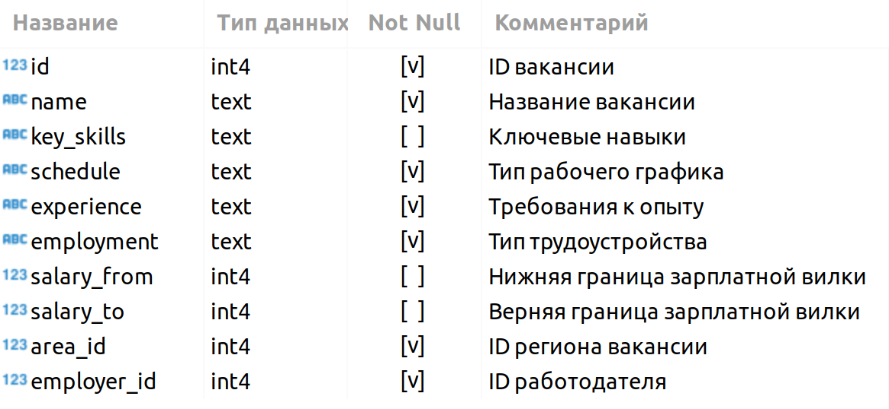
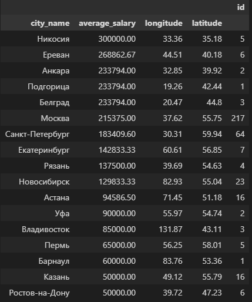

# Проект 2. Аналитик в компании HeadHunter 

  
 

## Оглавление:

[1. Описание проекта](README.md#описание-проекта)  
[2. Какой кейс решаем?](README.md#какой-кейс-решаем)  
[3. Краткая информация о данных](README.md#краткая-информация-о-данных)  
[4. Этапы работы над проектом](README.md#этапы-работы-над-проектом)  
[5. Ссылка на репозиторий](README.md#ссылка-на-репозиторий)  
[6. Выводы](README.md#выводы)  

### Описание проекта

Мы вступаем в роль аналитика, трудоустроившегося в агентство по подбору IT-специалистов. Нашей задачей является разработка модели, которая позволит нам искать и находить вакансии для наших IT-специалистов. 

> Файл с исходными данными (вакансии с сайта HH.ru) находится на удаленном сервере БД. К сожалению, в рамках учебного процесса нельзя предоставить доступ для ознакомления.

### Какой кейс решаем?

>* Решение оформляется только в *Jupyter Notebook*.
>* Решение оформляется в соответствии с [ноутбуком-шаблоном](https://lms.skillfactory.ru/asset-v1:SkillFactory+DST-3.0+28FEB2021+type@asset+block@Project_2_%D0%9D%D0%BE%D1%83%D1%82%D0%B1%D1%83%D0%BA_%D1%88%D0%B0%D0%B1%D0%BB%D0%BE%D0%BD.ipynb).
>* Каждое задание выполняется в отдельной ячейке, выделенной под задание (в шаблоне они помечены как **ваш код здесь**). Не следует создавать много ячеек для решения задачи — это провоцирует неудобства при проверке.
>* Текст *SQL*-запросов и код на *Python* должны быть читаемыми. Не забывайте про отступы в *SQL*-коде.
>* Выводы по каждому этапу оформляются в формате Markdown в отдельной ячейке (в шаблоне они помечены как **ваши выводы здесь**).
>* Выводы можно дополнительно проиллюстрировать с помощью графиков. Они оформляются в соответствии с теми правилами, которые мы приводили в модуле по визуализации данных.
>* Не забудьте удалить ячейку с данными соединения перед фиксацией работы в GitHub.

### Краткая информация о данных

В проекте присутсвует 5 взаимосвязанных таблиц:
1. VACANCIES: Таблица хранит в себе данные по вакансиям и содержит следующие столбцы:

2. AREAS: Таблица-справочник, которая хранит код региона и его название.

3. EMPLOYERS: Таблица-справочник со списком работодателей.

4. INDUSTRIES: Таблица-справочник вариантов сфер деятельности работодателей.

5. EMPLOYERS_INDUSTRIES: Дополнительная таблица, которая существует для организации связи между работодателями и сферами их деятельности.

### Этапы работы над проектом

>Для решения данной задачи были применены следующие этапы:

>1. Импорт библиотек:
    * pandas as pd - - работа с таблицами;
    * psycopg2 - для работы с SQL;
    * urllib.parse as req - для работы с HTML;
    * requests - для работы с HTML;
    * bs4 import BeautifulSoup - библиотека для извлечния данных из HTML.

2. Подключение к Базе Данных:

    * dbname — название базы, к которой нужно подключиться;
    * user — имя пользователя в СУБД;
    * password — пароль;
    * host — адрес, по которому нужно подключиться;
    * port — порт, к которому нужно подключиться (по умолчанию равен 5432).
3. Предварительный анализ данных:
    * Vacancies - данные о вакансиях, содержит 49197 строк;
    * Areas - справочник с регионами, содержат 1362 строк;
    * Employers - справчник с наименованием работадателей, содержит 23501 строк;
    * Industries - справчник со сферами деятельности, содержит 294 строк.
4. Детальный анализ данных: 
    После получения первичных данных с первого блока, переходим к анализу вакансий. 
    * В первом задании определили количество вакансий в каждом регионе и как ожидалось, чем больше регион по численностью проживающих людей, тем больше вакансий размещено. Соответственно  на первом месте это Москва (5333 вакансий), следующим стал Санкт-Петербург (2851) и далее города идут по убыванию;
    * Во-втором задании определили количество вакансий с представленной вилкой по зарплате либо по верхнему пределу, либо по нижнему пределу, или наличие двух вилок одновременно. Данный показатель составляет 24073 вакансии. Если вспомнить, что всего вакансий 49197, то не трудно заменить, что только половину вакансий имеют вилку. Соответственно вакансий с пустыми вилками составляет (49197-24073) 25124. Честно говоря, мне казалось, что пустых вилок будет намного больше. Бытует мнение, что это делается для того, чтобы при собеседовании с кандидатом тот сам озвучивал желаемую зарплату и если озвученная зарплата будет выше той суммы, что заложена в штатном расписание, кандидату просто вежливо об этом скажут, а если кандидат назовет предпочитаемую зарплату меньше, чем указанная в штатном расписание, то компания скорей всего согласиться на эти условия так как она потенциально сэкономит на человеке. Этот трюк делается лишь потому, что ФОТ составляет большую или одну из больших статей затрат в любой организации;
    *   В-третьем задании мы выявили средние показатели вилок по зарплате нижнего предела (71065 руб.) и верхнего предела (110537 руб.) Эти показатели дают представление о потенциальных возможностях для соискателей. Но, сам подход вывода среднего показателя кажется немного сомнительным, потому что:
        1. Согласно вводным данным все зарплаты переведены в рубли - следовательно курс валют на момент перевода мог оказаться выбросом. Так как нет даты, на какое число представлен датасет;
        2. Количество выложенных вакансий в городах с проживающим большем количеством людей больше, чем в городах с меньшим количеством людей, от сюда следует, что из-за конкуренции в мегаполисе по типу Москва и Санкт-Петербург нижний предел зарплат высокий, а при анализе среднего показателя по всем вакансиям среднее число размывается;
        3. Сомнительное число верхнего предела 110537 руб. Данное сомнение заключается в следующем:
            * Все мы понимаем, что на ответственные руководящие должности приглашаются в основном по знакомству и их зарплаты обсуждаются за закрытыми дверями, поэтому таких вакансий не встретить на портале HH.RU;
        * В заключение данного пункта, хочется подчеркнуть, что выявленный расчет условный и на него нельзя оперироваться, без предварительной обработки вакансий, далее для более четкого представления необходимо добавлять градации по регионам и еще по направлениям, так как одна должность ценится больше по отношению к другой должности. 
    * В-четвертом задании было выявлено количество вакансий для типа работы и способа работы. Данный показатель является полным и его можно брать за основу при анализе вакансий. Расчет имеет глубинное представление, для примера привожу три первых значений по количеству выложенных вакансий. На первой строке это полный день и полная занятость имеет 35367 вакансий, на второй строке удаленная работа и полный день имеет 7802 вакансии и на третьей строке гибкий график и полная занятость имеет 1593 вакансий. Из этих трех представленных строк можно четко отследить тенденцию в датасете, так основную часть вакансий имеет традиционный способ работы, но с развитием интернет-технологий начинает увеличиваться количество вакансий на удаленном формате работы. Удаленный формат работы будет и дальше развиваться, так как данный формат потенциально может экономить организации деньги на содержание сотрудников в офисе. Третью и остальные строки составляют только (49197-35367-7802) 6028 вакансий. Почему так? Все дело в том, что портал HH.RU больше акцентирован на поиск среднего класса сотрудников, так как такие должности как разнорабочие и грузчики в большей своей массе не пользуется данным порталом, а высшее руководство как было подчеркнуто выше набираются по знакомству и рекомендациям;
    * В-пятом задании было рассчитано количество выложенных вакансий по требуемому опыту. Полученные данные является весьма закономерны и нормальные. Так, например, 26152 вакансий имеют тип требуемого опыта "От 1 года до 3 лет", это говорит о том, что чуть больше половины от всех вакансий требуется не большой опыт, скорей всего это связано с тем, что у линейных руководителей бывают несколько штатных сотрудников. Второй тип требуемого опыта "От 3 до 6 лет", что составляет 14511 вакансий следуя моей логике, это скорее уже как раз вакансии линейных руководителей. Третий тип "Нет опыта" и 7197 вакансий, данный тип встречается во всех должностях без исключения, так как это один из способов привлечь людей. Ну и последний тип "Более 6 лет", что составляет 1337 вакансий и тут могут быть как руководители организации, так и суперквалифицированные, но при этом узконаправленные специалисты. 

>* Проведенный детальный анализ данных позволяет понять основные тенденции на рынке труда, но требует дополнительных исследований и обработки данных для получения более точных и релевантных результатов. Также важно учитывать, что различные регионы и сферы деятельности могут иметь существенные отличия, которые необходимо учитывать при анализе. Переходим к следующему разделу посвященный анализу работодателей. 

5. Анализ работодателей:  

    Проанализировав блок по вакансиям, мы переходим к анализу работодателей. 
    * В первом же задании мы выводим наименование организации и количество выложенных вакансий. Полученный результат является весьма ошеломительным т.к. на первом месте находится "Яндекс" с количеством выложенных вакансий 1933, на пятом месте "Газпром нефть" с 331 вакансией. У "Яндекса" такое большое количество вакансий т.к. компания диверсифицирована и род ее большого количества направлений требует большого количества сотрудников, такие например как курьеры, таксисты, операторы кол-центров и т.п. На пятом месте "Газпром нефть" и в основном там нужны люди в большом количестве для обслуживания нефтеперерабатывающих предприятий, но из-за того, что предприятий не такое большое количество как у "Яндекса", соответственно и людей нужно меньше;
    * Во втором задании необходимо было вывести компанию и количество вакансий в разрезе региона, а в ответе указать тот регион, в котором есть большое количество работодателей, но при этом нет вакансий и этот регион стал "Россия". Что тут можно сказать? Судя по ответу можно лишь подчеркнуть, что в датасете представлено 410 компаний находящиеся в "России";
    * В третьем задании необходимо было посчитать количество регионов, в которых размещает каждая отдельно взятая компания и естественно на первом месте находится компания "Яндекс" с показателем 181, это лишний раз подтверждает масштаб организации; 
    * В четвёртом задании необходимо было высчитать число организаций не указавшие свою сферу деятельности и их оказалось 8419 компаний, это не много так как всего компаний представленные в датасете составляет 40752 организации;
    * В пятом задании надо было посчитать количество сфер деятельности у каждой компании и вывести те компании, у которых указано 4 сферы деятельности, а в ответе указать компанию, которая находится в алфавитном порядке на 3 месте и этой компанией оказалась "2ГИС" - данная компания занимается: 
        1. Производство мультимедиа, контента, редакторская деятельность;
        2. Консалтинговые услуги;
        3. Кол-центры, диспетчерские службы;
        4. Интернет-компания (поисковики, платежные системы, соц.сети, информационно-познавательные и развлекательные ресурсы, продвижение сайтов и прочее).
    * В шестом задании необходимо было вывести количество работодатель у которых прописана сфера деятельности "Разработка программного обеспечения" и таких компаний оказалось 3553, если учесть, что всего представлено 40752 организации, то это число достаточно хорошее, так как сфер деятельности присутствует огромное множество. Также хочется отметить, что с развитием интернет-технологий количество организаций с такой сферой деятельностью будет только увеличиваться;
    * В седьмом задании, надо было взять список городов миллионников из интернета источника "Wikipedia", и посчитать количество выложенных вакансий в конретконкретных населенных пунктах, а также вывести общее количество вакансий и все это сделать напримере организации "Яндекс". Получилось 16 городов и лидерами по количеству выложенных вакансий стали такие города как Москва - 54, Санкт-Петербург - 42 и т.д. а общее количество выложенных вакансий в этих городах составило 485. Данные являются весьма закономерны, так как чем больше город, тем больше компания предоставляет услуг и продуктов, а чтобы предоставлять свои услуги и продукты, нужны как раз эти сотрудники. 

>* Вывод по блоку: Мы подробно ознакомились с компаниями и их сферами деятельности, а также проанализировали количество вакансий с учетом наименований компаний, их сферы деятельности и населенных пунктов, в которых представлены эти вакансии.
6. Предметный анализ: 
* Изучив предварительно представленные организации  в датасете, мы переходим к самому интересному блоку предметного анализа.

    * В первом задании подсчитываем количество вакансий, содержащих определенные ключевые слова в названии, таких вакансий оказалось 1771 штук.;
    * Во втором задании исследуем вакансии для начинающих дата-сайентистов с дополнительными условиями, такими как отсутствие опыта, тип работы "стажировка" и наличие слова "Junior" в названии. В итоге находим 51 такую вакансию;
    * В третьем задании анализируем вакансии для начинающих дата-сайентистов с требованием навыков "SQL" и "Postgres". Таких вакансий оказалось 201 шт; 
    * В четвертом задании надо было посчитать количество вакансий для наинающих дата-сайнтистов, с наличием требуемого знания "Python", таких вакансий окалось 351 шт;
    *  В пятом задании надо было вывести средний показатель количества указанных работадателем необходимых навыков для начинающих дата-сайнтистов, этот показатель составил 6.41. Это говорит о том, что нашему специалисту необходимо иметь как минимум 6 навыков, для того, чтобы его смогли взять на работу;
    * В шестом задании, необходимо было вывести средний показатель зарплаты дата-сайнтиста имеющий опыт "От 3 до 6 лет". В ответе получилось 243115 руб. Сама по себе зарплата явялется достаточно хорошей и привлекательной, учитывая тот факт, что удаленный тип работы еще увеличивается, то вырисовывается красивая картина. А еще это лишний раз подчеркивает, что программисты и аналитики востребованы на сегодняшнем рынке. 

>* В данном блоке было подробно расмотрен такой специалист как дата-сайнтист. Определили количетсво вакансий с разными условиями, необходимое количетсво нужных навыков и конечно же просчитали среднюю зарплату. 
7. Дополнительные исследования данных.Задача найти вакансии в каждом городе для DataScients и определить сколько вакансий имеется и какая там средняя зарплата.
    * Для начала выгружаем из БД все вакансии и регионы с фильтром по DS. В ответе получается 480 вакансий;
    * Для вычисления средних зарплат мы проводим следующие действия. 
        * Логика заключается в том, что в представленном df_query_7_1 есть salary_from и salary_to. Я сначала делаю сортировка по региону в этом регионе счиатю среднее по salary_from, затем средний показатель salary_to. Когда получая два числа складываю их между собой и делю на два, так я получаю среднюю зарплату в каждом регионе. 
    * После первичной обработке в таблице осталось множество пропусков (NaN). Для их обработки выполнены следующие действия: 
        * Сначала заполняем значения в переменной average_df средними зарплатами по регионам: 
            * Затем проходим по average_df и, если в каком-либо регионе нет данных (NaN), ищем значение в df_query_7_1;
            * Если находим число, заменяем NaN на это число, не выполняя дополнительных вычислений;
            * После заполнения данных объединяем average_df с исходным df_query_7_1.
    * Теперь необходимо подготовить данные к построению графика. В моем представление график должен из себя представлять график, на котором будут указаны города, количество вакансий в этих городах и средние зарплаты. Для этого понадобиться: 
        * Приводим регионы к общему формату, например, переименовываем названия стран в столицы или переименовываем город Алматы в столицу Астану;
        * После того, как мы получили список городов, необходимо выгрузить широту и долготу городов из интернет-источника для корректного отображения на карте;
        * Создаем график, на котором отображены кружки с местоположением городов, а также цвет кружков, представляющий количество вакансий, и размер кружков, отражающий среднюю зарплату.

**Готовая таблица перед построением графика**

**График распределений вакансий по городам**

* Вывод: Анализируя выполненную работу, мы замечаем следующие интересные моменты на графике: 
    * Большие кружки представлены вне России, что может объясняться высокой ценностью этих вакансий или изменениями в курсе рубля на момент сбора данных с сайта HH.ru.
    * Города с более крупным населением имеют более яркий цвет кружков, что указывает на большее количество представленных вакансий. Это наблюдается, например, в Москве, Санкт-Петербурге и Новосибирске.

### Ссылка на репозиторий

Для просмотра кода, предлагаю перейти по сслыкам. 

1. [Ссылка на git hub](https://github.com/qv1k1/I_Win/blob/main/02%20%D0%9F%D1%80%D0%BE%D0%B5%D0%BA%D1%82%D1%8B/project_3/Project_2_%D0%9D%D0%BE%D1%83%D1%82%D0%B1%D1%83%D0%BA_%D1%88%D0%B0%D0%B1%D0%BB%D0%BE%D0%BD.ipynb)
2. [Ссылка на colab](https://colab.research.google.com/drive/1U2IquL6yLeRFkFkXjB9WUBiJt15IDfin?usp=sharing)

### Выводы

> Вся работа была разбита на 7 блоков:
* Импорт основных библиотек для работы;
* знакомство с данными;
* предварительный анализ данных;
* детальный анализ вакансий;
* анализ работодателей;
* предметный анализ;
* дополнительные исследования. 

В первом блоке мы импортировали библиотеки, которые использовались в процессе работы для более корректного анализа данных;

Во втором блоке мы ознакомились с данными и узнали, что в них содержится 5 таблиц, которые использовались для анализа;

В третьем блоке мы провели предварительный анализ данных, включая распределение вакансий по регионам и оценку зарплатных интервалов. В этом блоке мы узнали что в таблице "Employers" содержится 23501 строк с наименованием работадателей и "Vacancies" в которой содержиться 49197 вакансий (строк);

В-четвертом блоке, постарались сделать первчиный анализ данных и выявили распределение вакансий по регионам, увидели размер средней минимальной и максимальной вилки по зарплате;

В пятом блоке сфокусировались на анализе работодателей и выявили интересные моменты в данных, такие как количество компаний, не указавших свою сферу деятельности а также выявили, что больше всего вакансий разместила компания "Яндекс" - 1933 вакансии в 181 регионах. Далее усложнив задачу, выписали 16 городов миллионников России с помощью запроса в "Wikipidia" и получили 485 вакансий, где в топ вошли такие города как Москва с 54 вакансиями и Санкт-Петербург с 42 вакансиями. 

В шестом блоке предметно расмотрели специалиста DataScience и результат оказался следующим, всего пристутсвует 51 вакансия для начинащих специалистов. Вакансий с требованием знания "Python", оказалось 351 шт. Вакансий с наличием навыка "SQL" и "Postgres" оказалось 201 шт. В среднем каждый DS специалист должен обладать как минимум 6 навыками. Специалисты у которых есть опыт от 3 до 6 лет в среднем могут получать 243115 руб.;

В-седьмом блоке, был подробно разобран специалист DS и его возможности. Были выгружен запрост с SQL, после чего создана модель для расчета средней зарплаты по каждому представленному региону. Далее выгружен с HTML страницы долгота и широта каждого региона, после чего был построен график карты, на котором отчетливо видно, что DS может получать высокую зарплату трудоустроившись в заграничную компанию, а также видно, что больше всего вакансий предложено в наших двух столицах. 

Работа проделана великолепно, и анализ данных может быть полезен для агентств по подбору вакансий и соискателей.

[К оглавлению](README.md#оглавление)