# Проект 4. ИССЛЕДОВАНИЕ ДАННЫХ HR-АГЕНТСТВА

  
 

## Оглавление:

[1. Описание проекта](README.md#описание-проекта)  
[2. Какой кейс решаем?](README.md#какой-кейс-решаем)  
[3. Краткая информация о данных](README.md#краткая-информация-о-данных)  
[4. Этапы работы над проектом](README.md#этапы-работы-над-проектом)  
[5. Ссылка на репозиторий](README.md#ссылка-на-репозиторий)  
[6. Выводы](README.md#выводы)  

### Описание проекта

HR-агентство изучает тренды на рынке труда в IT. Компания хочет провести исследование на основе данных о зарплатах в сфере Data Science за 2020–2022 годы и получить некоторые выводы. 

> Файл с исходными данными находится по [ссылке](https://lms.skillfactory.ru/asset-v1:SkillFactory+DST-3.0+28FEB2021+type@asset+block@ds_salaries.zip)

Необходимо исследовать данные и сделайть выводы по полученным результатам. Подкрепить свои рассуждения и выводы визуализациями и с помощью статистического тестирования провереть, являются ли выводы статистически значимыми.

### Какой кейс решаем?

>* Загрузка и обработка данных (2 балла)
>* Разведывательный анализ данных (4 балла)
>   * Визуальный анализ данных (2 балла)
>   * Статистический анализ данных (2 балла)
>* Соответствие выводов бизнес-вопросам (4 балла)
>* Дополнительное исследование (2 балла)
>* Оформление исследования (2 балла)
>* Продемонстрировать использование разных тестов для проверки статистической значимости сделанных выводов:
>   * тесты для количественного признака:
>       * для одной выборки;
>       * для двух выборок;
>       * для нескольких выборок;
>   * тест для категориальных признаков.

### Краткая информация о данных

ds_salaries.csv: данные о зарплатах в сфере Data Science за 2020–2022 годы. 

|НАИМЕНОВАНИЕ СТОЛБЦА|	ОПИСАНИЕ|
|--|--|
|work_year|	Год, в котором была выплачена зарплата.|
|experience_level|	Опыт работы на этой должности в течение года со следующими возможными значениями: EN — Entry-level/Junior; MI — Mid-level/Intermediate; SE — Senior-level/Expert; EX — Executive-level/Director.|
|employment_type| 	Тип трудоустройства для этой роли: PT — неполный рабочий день; FT — полный рабочий день; CT — контракт; FL — фриланс.|
|job_title| 	Роль, в которой соискатель работал в течение года.|
|salary|	Общая выплаченная валовая сумма заработной платы.
salary_currency|	Валюта выплачиваемой заработной платы в виде кода валюты ISO 4217.|
|salary_in_usd|	Зарплата в долларах США (валютный курс, делённый на среднее значение курса доллара США за соответствующий год через fxdata.foorilla.com).|
|employee_residence|	Основная страна проживания сотрудника в течение рабочего года в виде кода страны ISO 3166.|
|remote_ratio|	Общий объём работы, выполняемой удалённо. Возможные значения: 0 — удалённой работы нет (менее 20 %); 50 — частично удалённая работа; 100 — полностью удалённая работа (более 80 %).|
|company_location| 	Страна главного офиса работодателя или филиала по контракту в виде кода страны ISO 3166.|
|company_size|	Среднее количество людей, работавших в компании в течение года: S — менее 50 сотрудников (небольшая компания); M — от 50 до 250 сотрудников (средняя компания); L — более 250 сотрудников (крупная компания).|

### Этапы работы над проектом

>Для решения данной задачи были применены следующие этапы:

1. Импорт библиотек:
    * pandas as pd - работа с таблицами;
    * numpy as np - работа с массивами;
    * scipy import stats - библиотека для научных вычислений;
    * statsmodels.api as sm - импорт команд;
    * statsmodels import stats as sms - импорт команд;
    * matplotlib.pyplot as plt - библиотека для визуализации данных;
    * seaborn as sns - библиотека для визуализации данных;
    * sklearn import preprocessing - обработка данных.

2. Основные вопросы, которые будут затронуту в проекте:

    2.1. Выяснить, какие факторы влияют на зарплату специалиста Data Scientist.
    2.2. А также ответить на ключевые вопросы HR-агентства:
    *  Наблюдается ли ежегодный рост зарплат у специалистов Data Scientist?
    *  Как соотносятся зарплаты Data Scientist и Data Engineer в 2022 году?
    *  Как соотносятся зарплаты специалистов Data Scientist в компаниях различных размеров?
    *  Есть ли связь между наличием должностей Data Scientist и Data Engineer и размером компании?

    2.3. Дополнительные вопросы для HR-агенства:
    * Как соотноситья оплата труда от опыта работы специалиста?
    * Как соотноситься оплата труда от типа трудоустройства? 
    * Есть ли связь между размером компании и типом трудоустройства сотрудников? 
    * Есть ли связь между размером компании и объемом удаленно выполняемой работы?

3. Задаю уровень значимости:
    * $\alpha=0.05$.

4. Детальный анализ данных:
    * Проверка на наличие пропусков - пропуски в df отсутствуют;
    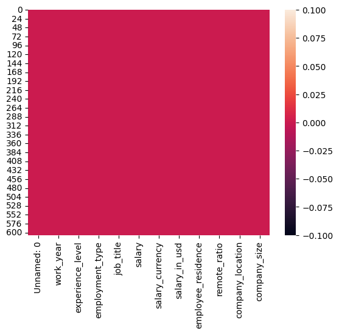
    * Проверка на наличие дубликатов: 
        * Количество дубликатов: 0;
        * Размер таблицы после удаления дубликатов: (607, 12).

5. Описательный анализ данных: 
    * Начисление зарплат специалистам Data Scientist
        * Проверка на нормальность - Гистограмма:
        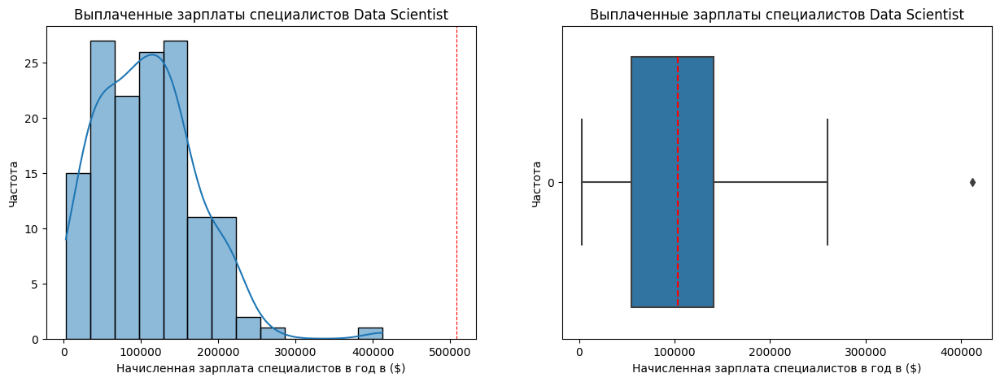
            * Итог по первому тесту:  показывает, что данные распределены не нормально - присутсвует пенек на отметке в 400 тыс. и на диограмме с усами присутвует точка с выбросом на отметке в 400 тыс. Для подтверждения увиденного провожу следующий тест.
        * Проверка на нормальность - КВАНТИЛЬ-КВАНТИЛЬ ГРАФИК:
        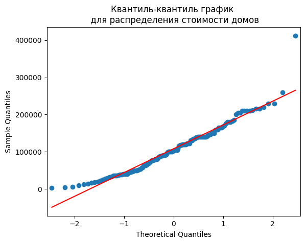
            * Итог по второму тесту: показывает, что данные распределены не нормально.
        * Итог: расределение зарплат у специалистов отлично от нормального, имеются выбросы.
    * Ежегодное изменение зарплат у специалистов DS 
        * Проверка на нормальность - Коробчатая диограмма:
        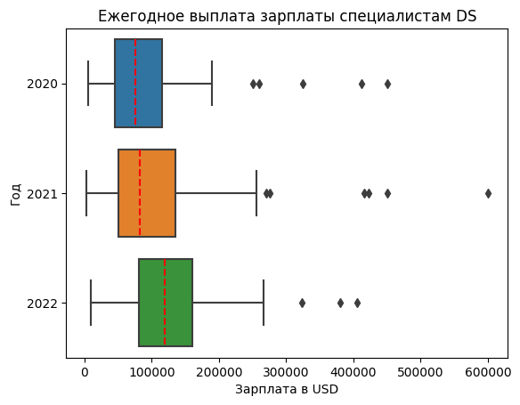
        * Итог: На первый взгляд распределения зарплат по годам различны. Чтобы определить, являются ли эти различия статистически значимыми, в следующем разделе мы проведём статистическое тестирование.
    * Измерение зарплат Data Scientist и Data Engineer в 2022 году
        * Проверка на нормальность - Коробчатая диограмма:
        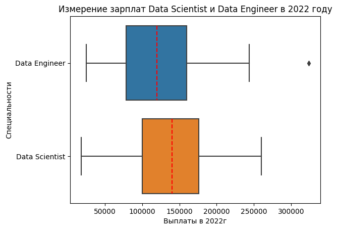
        * Итог: распределение зарплат в 2022 году различны в зависимости от специальности  Data Engineer или  Data Scientist. Чтобы определить, являются ли эти различия статистически значимыми, в следующем разделе мы проведём статистические тесты.
    * Начисление зарплаты специалистам Data Scientist в зависимости от размера организации
        * Проверка на нормальность - Коробчатая диограмма:
        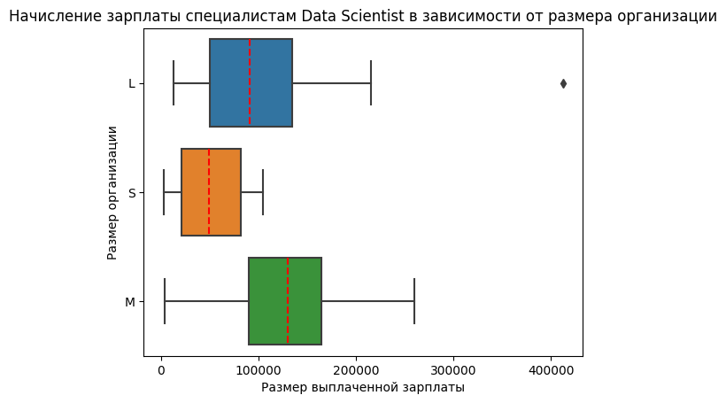
        * Итог: распределения зарплат Data Scientist-ов различны для разных организаций. Чтобы определить, являются ли эти различия статистически значимыми, в следующем разделе мы проведём статистические тесты.
    * Соотношение должностей Data Scientist и Data Engineer в зависимости размера организации 
        * Проверка на нормальность - Столбчатая диаграмма:
        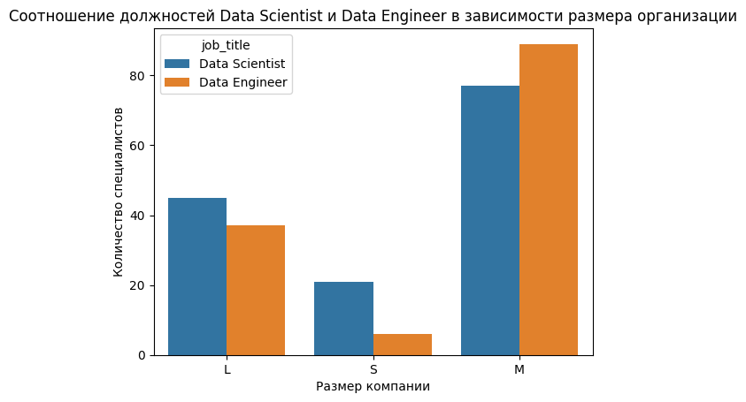
        * Проверка на нормальность - Тепловая карта:
        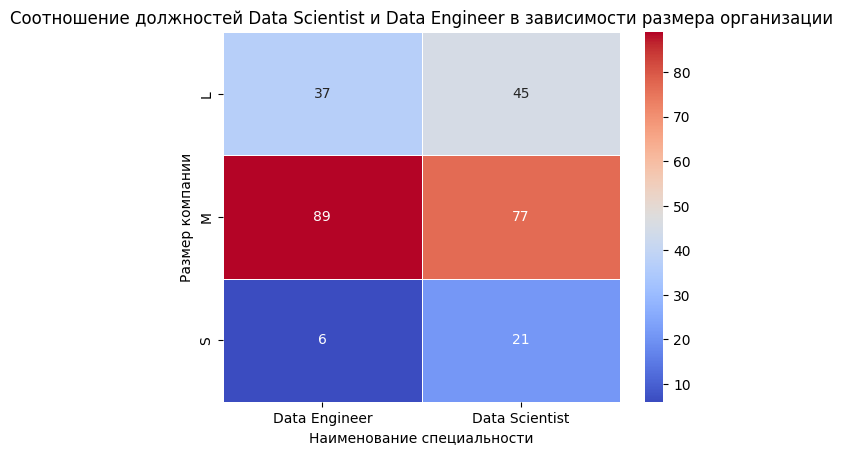
            * Итог: согласно данным, специалистов Data Engineer больше находятся в компаниях уровня "М", однако этих же специлостов самое маленькое количество в компаниях уровня "S". Специалисты Data Scientist, более равномерно распределены. Чтобы определить, являются ли эти различия статистически значимыми, в следующем разделе мы проведём статистические тесты.
    * Влияет ли оплата труда от уровня должности
        * Проверка на нормальность - Коробчатая диограмма:
        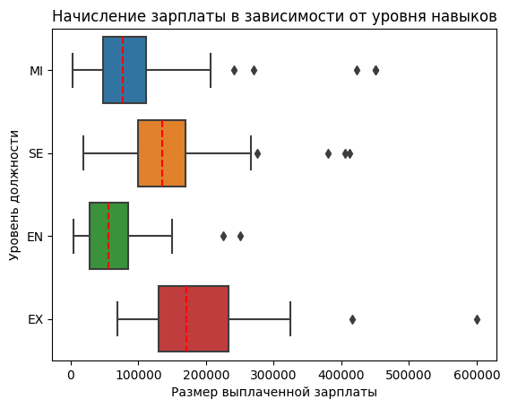
            * Итог: распределения зарплат различны для разных уровней навыков. Чтобы определить, являются ли эти различия статистически значимыми, в следующем разделе мы проведём статистические тесты. 
    * Влияет ли тип трудоустройства от зарплаты?
        * Проверка на нормальность - Коробчатая диограмма: 
        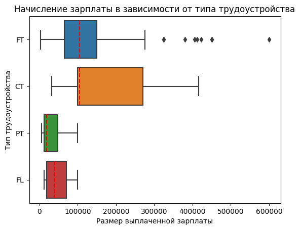
            * Итог: распределения зарплат различны для разных типов трудоустройства. Чтобы определить, являются ли эти различия статистически значимыми, в следующем разделе мы проведём статистические тесты.
    * Влияет ли размер компании от типа трудоустроенных людей в компании 
        * Проверка на нормальность - Тепловая карта:
        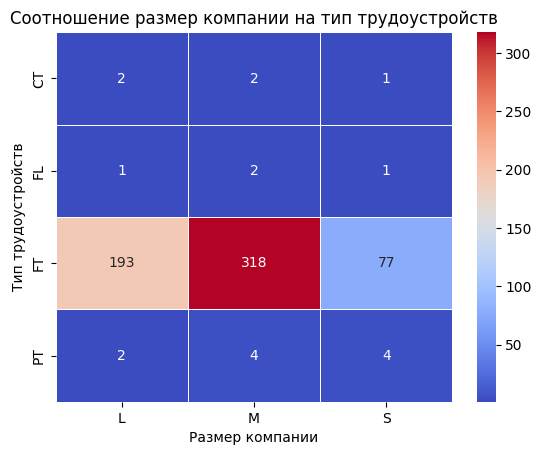
            * Итог: согласно данным, большинство специалистов находятся работают по типу трудоустройства FT - полный рабочий день. То есть работают в офисе. Также этих специалистов больше всего находятся в компаниях среднего размера тип M. Чтобы определить, являются ли эти различия статистически значимыми, в следующем разделе мы проведём статистические тесты.
    * Влияет ли размер компании на объем выполняемой работы удаленно? 
        * Проверка на нормальность - Столбчатая диаграмма:
        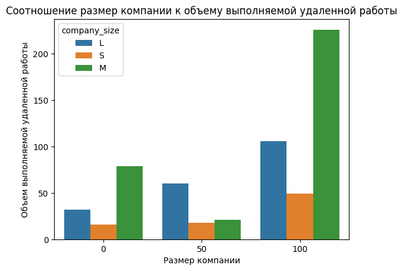
        * Проверка на нормальность - Тепловая карта:
        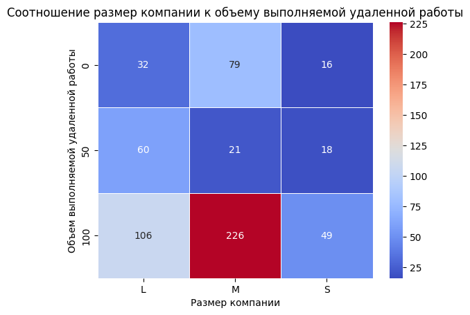
            * Итог: согласно данным, во всех пересечениях пристутсвует некая связь, безусловно сильная связь наблюдается в категории полностью удаленного формата работы в уровнях компании типа "S" и "M". Чтобы определить, являются ли эти различия статистически значимыми, в следующем разделе мы проведём статистические тесты.

6. Статистический анализ данных
    * Наблюдается ли ежегодный рост зарплат у специалистов Data Scientist?
        * **Сформулируем нулевую и альтернативные гипотезы**
            * *Нулевая гипотеза* ($H_0$): зарплата специалистов Data Scientist не меняется год от года (m);
            * *Альтернативная гипотеза* ($H_1$): зарплата специалистов Data Scientist (m) увеличивается каждый год.
        * **Проверка на нормальность**
            * С помощью теста Шапиро-Уилка проверим, распределён ли признак нормально. Напомним гипотезы теста Шапиро-Уилка:
                * *Нулевая гипотеза* ($H_0$): распределение данные является нормальным;
                * *Альтернативная гипотеза* ($H_1$): распределение данных отлично от нормального.
            * p-value = 0.000 - Распределение не нормальное.
        * **Выберем подходящий статистический тест**
            * Для выбора нужного теста воспользуемся алгоритмом выбора теста. Для этого ответим на следующие вопросы:
                * Какой тип у признака «Выплата зарплаты»? — Количественный.
                * Сколько сравниваемых групп? — три.
                * Группы зависимы? — Нет.
                * Признак распределён по нормальному закону? — Нет.
            * Чтобы проверить нашу гипотезу, можно использовать Критерий Краскела-Уоллиса для сравнения распределений на основе рангов.
        * **Проведём тест**
            p-value = 0.000 - p-значение меньше, чем заданный уровень значимости 0.05. Отвергаем нулевую гипотезу в пользу альтернативной.
        * **Вывод** - Зарплата специалистов Data Scientist увеличивается каждый год
    * Как соотносятся зарплаты Data Scientist и Data Engineer в 2022 году?
        * **Сформулируем нулевую и альтернативные гипотезы**
            * *Нулевая гипотеза* ($H_0$): зарплата Data Scientist ($μ_1$) в 2022 году равна зарплате Data Engineer ($μ_2$) в 2022 году;
            * *Альтернативная гипотеза* ($H_1$): зарплата Data Scientist ($μ_1$) в 2022 году отличается от зарплаты Data Engineer ($μ_2$) в 2022 году.
        * **Проверка на нормальность**
            * Для специалистов Data Scientist: p-value = 0.327 - p-значение больше, чем заданный уровень значимости 0.05. Распределение является нормальным
            * Для специалистов  Data Engineer: p-value = 0.010 - p-значение меньше, чем заданный уровень значимости 0.05. Распределение отлично от нормального
        * **Выберем подходящий статистический тест**
            * Для выбора нужного теста воспользуемся алгоритмом выбора теста. Для этого ответим на следующие вопросы:
                * Какой тип у признака «Выплата зарплаты»? — Количественный.
                * Сколько сравниваемых групп? — две.
                * Группы зависимы? — Нет.
                * Признак распределён по нормальному закону? — Нет.
            * Чтобы проверить нашу гипотезу, можно использовать U-критерий Манна-Уитни для сравнения распределений на основе рангов.
        * **Проведём тест**
            * p-value = 0.155 - p-значение больше, чем заданный уровень значимости 0.05. У нас нет оснований отвергнуть нулевую гипотезу.
        * **Вывод** - Нет оснований утверждать, что зарплаты специалистов Data Scientist и Data Engineer имееют сильное различие.
    * Как соотносятся зарплаты специалистов Data Scientist в компаниях различных размеров?
        * **Сформулируем нулевую и альтернативные гипотезы**
            * *Нулевая гипотеза* ($H_0$): зарплата специалистов Data Scientist ($μ_1$)не зависит от размера компании (S, M, L);
            * *Альтернативная гипотеза* ($H_1$): зарплата специалистов Data Scientist ($μ_1$) зависит от размера компании(S, M, L).
        * **Проверка на нормальность**
            * Для специалистов Data Scientist и размер компании S: p-value = 0.189 - p-значение больше, чем заданный уровень значимости 0.05. Распределение является нормальным
            * Для специалистов  Data Engineer и размер компании M: p-value = 0.639 - p-значение больше, чем заданный уровень значимости 0.05. Распределение является нормальным
            * Для специалистов  Data Engineer и размер компании L: p-value = 0.000 - p-значение меньше, чем заданный уровень значимости 0.05. Распределение отлично от нормального
        * **Выберем подходящий статистический тест**
            * Для выбора нужного теста воспользуемся алгоритмом выбора теста. Для этого ответим на следующие вопросы:
                * Какой тип у признака «Выплата зарплаты»? — Количественный.
                * Сколько сравниваемых групп? — три.
                * Группы зависимы? — Нет.
                * Признак распределён по нормальному закону? — Нет.
            * Чтобы проверить нашу гипотезу, можно использовать Критерий Краскела-Уоллиса для сравнения распределений на основе рангов.
        * **Проведём тест**
            * p-value = 0.000 - p-значение меньше, чем заданный уровень значимости 0.05. Отвергаем нулевую гипотезу в пользу альтернативной.
        * **Вывод** - зарплата специалистов Data Scientist зависит от размера компании!.
    * Есть ли связь между наличием должностей Data Scientist и Data Engineer и размером компании?
        * **Сформулируем нулевую и альтернативные гипотезы**
            * *Нулевая гипотеза*: нет связи между наличием должностей Data Scientist и Data Engineer и размером компании. (признаки независимы);
            * *Альтернативная гипотеза*: существует связь между наличием должностей Data Scientist и Data Engineer и размером компании (признаки зависимы).
        * **Выберем подходящий статистический тест**
            * Для выбора нужного теста воспользуемся алгоритмом выбора теста. Для этого ответим на следующие вопросы:
                * Какой тип у признака «Размер компании»? — Категориальный.
                * Сколько сравниваемых групп? — Две.
                * Проверяется независимость групп? — Да
            * Для проверки нашей гипотезы можно использовать критерий ${\chi}^2$ (хи-квадрат).
        * **Проведём тест**
            * p-value = 0.008 - p-значение меньше, чем заданный уровень значимости 0.05. Отвергаем нулевую гипотезу в пользу альтернативной.
        * **Вывод** - Существует статистически значимая взаимосвязь между выбором должности и размером организации.
    * Влияет ли оплата труда от уровня должности?
        * **Сформулируем нулевую и альтернативные гипотезы**
            * *Нулевая гипотеза*: оплата труда не зависит от уровня должности;
            * *Альтернативная гипотеза*: оплата труда зависит от уровня должности.
        * **Проверка на нормальность**
            * Уровень специалиста Entry-level/Junior: p-value = 0.167 - p-значение больше, чем заданный уровень значимости 0.05. Распределение является нормальным;
            * Уровень специалиста Executive-level/Director: p-value = 0.816 - p-значение больше, чем заданный уровень значимости 0.05. Распределение является нормальным;
            * Уровень специалиста Mid-level/Intermediate: p-value = 0.000 - p-значение меньше, чем заданный уровень значимости 0.05. Распределение отлично от нормального;
            * Уровень специалиста Senior-level/Expert: p-value = 0.000 - p-значение меньше, чем заданный уровень значимости 0.05. Распределение отлично от нормального.
        * **Выберем подходящий статистический тест**
            * Для выбора нужного теста воспользуемся алгоритмом выбора теста. Для этого ответим на следующие вопросы:
                * Какой тип у признака «Выплата зарплаты»? — Количественный.
                * Сколько сравниваемых групп? — четыре.
                * Группы зависимы? — Нет.
                * Признак распределён по нормальному закону? — Нет.
            * Чтобы проверить нашу гипотезу, можно использовать Критерий Краскела-Уоллиса для сравнения распределений на основе рангов.
        * **Проведём тест**
            * p-value = 0.000 - p-значение меньше, чем заданный уровень значимости 0.05. Отвергаем нулевую гипотезу в пользу альтернативной.
        * **Вывод** - Специалисты малого уровня обладают схожими зарплаты между собой и только, когда специалисты выростают до уровня эксперта, то зарплатные выплаты начинают отличаться от нормального.
    * Как соотноситься оплата труда от типа трудоустройства? 
        * **Сформулируем нулевую и альтернативные гипотезы**
            * *Нулевая гипотеза*: оплата труда не зависит от типа трудоустройства;
            * *Альтернативная гипотеза*: оплата труда зависит от типа трудоустройства.
        * **Проверка на нормальность**
            * Для специалистов и тип трудоустройства CT: p-value = 0.406 - p-значение больше, чем заданный уровень значимости 0.05. Распределение является нормальным;
            * Для специалистов и тип трудоустройства FL: p-value = 0.507 - p-значение больше, чем заданный уровень значимости 0.05. Распределение является нормальным;
            * Для специалистов и тип трудоустройства FT: p-value = 0.000 - p-значение меньше, чем заданный уровень значимости 0.05. Распределение отлично от нормального;
            * Для специалистов и тип трудоустройства PT: p-value = 0.023 - p-значение меньше, чем заданный уровень значимости 0.05. Распределение отлично от нормального.
        * **Выберем подходящий статистический тест**
            * Для выбора нужного теста воспользуемся алгоритмом выбора теста. Для этого ответим на следующие вопросы:
                * Какой тип у признака «Выплата зарплаты»? — Количественный.
                * Сколько сравниваемых групп? — четыре.
                * Группы зависимы? — Нет.
                * Признак распределён по нормальному закону? — Нет.
            * Чтобы проверить нашу гипотезу, можно использовать Критерий Краскела-Уоллиса для сравнения распределений на основе рангов.
        * **Проведём тест**
            * p-value = 0.000 - p-значение меньше, чем заданный уровень значимости 0.05. Отвергаем нулевую гипотезу в пользу альтернативной.
        * **Вывод** - Специлисты работающие по разным типам трудоустройствам (графикам), имеют разные зарплаты, следовательно отвергаем нулевую гипотезу.
    * Влияет ли размер компании от типа трудоустроенных людей в компании ?
        * **Сформулируем нулевую и альтернативные гипотезы**
            * *Нулевая гипотеза*: существенной связи между размером компании и типом трудоустройства нет;
            * *Альтернативная гипотеза*: существует связь между размером компании и типом трудоустройства.
        * **Выберем подходящий статистический тест**
            * Для выбора нужного теста воспользуемся алгоритмом выбора теста. Для этого ответим на следующие вопросы:
                * Какой тип у признака «Размер компании»? — Категориальный.
                * Сколько сравниваемых групп? — Две.
                * Проверяется независимость групп? — Да
            * Для проверки нашей гипотезы можно использовать критерий ${\chi}^2$ (хи-квадрат).
        * **Проведём тест**
            * p-value = 0.327 - p-значение больше, чем заданный уровень значимости 0.05. У нас нет оснований отвергнуть нулевую гипотезу.
        * **Вывод** - Нет основанйи отвергать нулевую гипотезу, следовательно категории размер компании и тип трудоустройства специалиста между собой не связаны.
    * Соотношение размер компании к объему выполняемой удаленной работы?
        * **Сформулируем нулевую и альтернативные гипотезы**
            * *Нулевая гипотеза*: существенной связи между размером компании и типом трудоустройства нет;
            * *Альтернативная гипотеза*: существует связь между размером компании и типом трудоустройства.
        * **Выберем подходящий статистический тест**
            * Для выбора нужного теста воспользуемся алгоритмом выбора теста. Для этого ответим на следующие вопросы:
                * Какой тип у признака «Размер компании»? — Категориальный.
                * Сколько сравниваемых групп? — Две.
                * Проверяется независимость групп? — Да
            * Для проверки нашей гипотезы можно использовать критерий ${\chi}^2$ (хи-квадрат).
        * **Проведём тест**
            * p-value = 0.000 - p-значение меньше, чем заданный уровень значимости 0.05. Отвергаем нулевую гипотезу в пользу альтернативной..
        * **Вывод** - Существует статистически значимая взаимосвязь между уровнем организацией и объемом выполняемой удаленной работы.

7. Итоговые результаты исследования
    1. Ответы на ключевые вопросы HR-агенства:
        *   Зарплата специалистов Data Scientist увеличивается каждый год;
        *   Нет оснований утверждать, что зарплаты специалистов Data Scientist и Data Engineer имееют сильное различие;
        *   Зарплата специалистов Data Scientist зависит от размера компании!;
        *   Существует статистически значимая взаимосвязь между выбором должности и размером организации.
    2. Дополнительные ответы для HR-агенства: 
        *   Специалисты малого уровня обладают схожими зарплаты между собой и только, когда специалисты выростают до уровня эксперта, то зарплатные выплаты начинают отличаться от нормального;
        * Специлисты работающие по разным типам трудоустройствам (графикам), имеют разные зарплаты, следовательно отвергаем нулевую гипотезу;
        * Нет основанйи отвергать нулевую гипотезу, следовательно категории размер компании и тип трудоустройства специалиста между собой не связаны;
        * Существует статистически значимая взаимосвязь между уровнем организацией и объемом выполняемой удаленной работы.

### Ссылка на репозиторий

Для просмотра кода, предлагаю перейти по сслыкам. 

1. [Ссылка на git hub](https://github.com/qv1k1/I_Win/blob/main/02%20%D0%9F%D1%80%D0%BE%D0%B5%D0%BA%D1%82%D1%8B/project_4/EDA-4.2_HR_agency.ipynb)
2. [Ссылка на colab](https://colab.research.google.com/drive/1QDmZZdT8i3-nltIDOlCaLW0cDdEijEZj?usp=sharing)

### Выводы

> Вся работа была разбита на 7 блоков:
* Импорт основных библиотек для работы;
* Основные вопросы, которые будут затронуту в проекте;
* Задаю уровень значимости;
* Детальный анализ данных;
* Описательный анализ данных;
* Статистический анализ данных;
* Итоговые результаты исследования. 

В первом блоке мы импортировали библиотеки, которые использовались в процессе работы для более корректного анализа данных;

Во втором блоке расписаны задачи, которые необходимо разобрать в проекте;

В третьем блоке задается уровень значимости для статистических тестов; 

В-четвертом блоке, познакомились с данными;

В пятом блоке распределили данные по вопросам и отобразили соответствующие графики для визуального отображения нормальности данных. 

В шестом блоке провели статистичесие тесты для нормального, ненормального и категориального распределения;

В-седьмом блоке, отображены выводы по каждому вопросу. 

Работа проделана великолепно, и анализ данных может быть полезен для агентств по подбору специалистов.

[К оглавлению](README.md#оглавление)