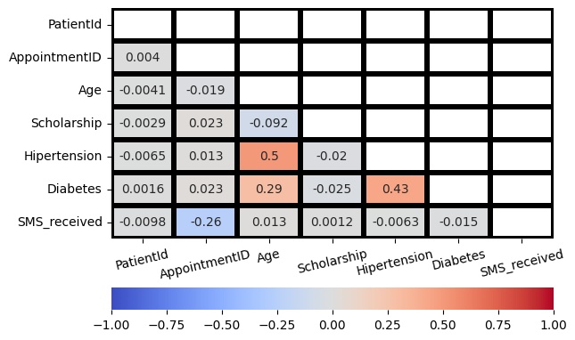

# Проект 4. ИССЛЕДОВАНИЕ ДАННЫХ HR-АГЕНТСТВА

  
 

## Оглавление:

[1. Описание проекта](README.md#описание-проекта)  
[2. Какой кейс решаем?](README.md#какой-кейс-решаем)  
[3. Краткая информация о данных](README.md#краткая-информация-о-данных)  
[4. Этапы работы над проектом](README.md#этапы-работы-над-проектом)  
[5. Ссылка на репозиторий](README.md#ссылка-на-репозиторий)  
[6. Выводы](README.md#выводы)  

### Описание проекта

Визуализируйте корреляцию между 7 числовыми признаками, использованными для обучения модели, и залогируйте изображение в Comet 

### Какой кейс решаем?

>* 	Проведена визуализация корреляции между 7 числовыми признаками, использованными для обучения модели (5 баллов)
>* Произведено логирование графика в Comet(10 баллов)

### Краткая информация о данных

[История болезни](https://www.kaggle.com/joniarroba/noshowappointments)

|НАИМЕНОВАНИЕ СТОЛБЦА|	ОПИСАНИЕ|
|--|--|
No_show| — пациент не пришёл на приём;
Gender| — пол пациента;
ScheduledDay| — день, когда планируется встреча;
AppointmentDay| — реальная дата встречи;
Age| — возраст пациента;
Neighbourhood| — район проживания каждого пациента;
Scholarship| — получает ли пациент стипендию;

### Этапы работы над проектом

>Для решения данной задачи были применены следующие этапы:

1. Импорт библиотек:
    * pandas as pd - работа с таблицами;
    * numpy as np - работа с массивами;
    * matplotlib.pyplot as plt - библиотека для визуализации данных;
    * seaborn as sns - библиотека для визуализации данных;
    * from comet_ml import Experiment - импорт платформы для анализа.

2. Отобразить 7 числовых признаков:
    

3. Залогировать график:
    [experiment.log_figure()](https://www.comet.com/qv1k1/medical-appointment/513fa2f560494bbab3ee092bb254b3ce?experiment-tab=images&graphicsAssetId=3fbf822375584456a082cdc3912105ae)

### Ссылка на репозиторий

Для просмотра кода, предлагаю перейти по сслыкам. 

1. [Ссылка на git hub](https://github.com/qv1k1/I_Win/blob/main/02%20%D0%9F%D1%80%D0%BE%D0%B5%D0%BA%D1%82%D1%8B/project_5/noshowappointments_cometml.ipynb)
2. [Ссылка на colab](https://colab.research.google.com/drive/1RHdGWtmYiCqITX3VrE82vrIGACCzWg7w?usp=sharing)

### Выводы

> Вся работа была разбита на 3 блока:
* Импорт основных библиотек для работы;
* Визуализирован график с 7ью признаками;
* График залогирован.

[К оглавлению](README.md#оглавление)