# Проект 7. PROJECT-3. EDA + Feature Engineering. Соревнование на Kaggle

  
 

## Оглавление:

[1. Описание проекта](README.md#описание-проекта)  
[2. Какой кейс решаем?](README.md#какой-кейс-решаем)  
[3. Краткая информация о данных](README.md#краткая-информация-о-данных)  
[4. Этапы работы над проектом](README.md#этапы-работы-над-проектом)  
[5. Ссылка на репозиторий](README.md#ссылка-на-репозиторий)  
[6. Выводы](README.md#выводы)  

### Описание проекта

Представьте, что вы работаете дата-сайентистом в компании Booking. Одна из проблем компании — это нечестные отели, которые накручивают себе рейтинг. Одним из способов обнаружения таких отелей является построение модели, которая предсказывает рейтинг отеля. Если предсказания модели сильно отличаются от фактического результата, то, возможно, отель ведёт себя нечестно, и его стоит проверить.

Вам поставлена задача создать такую модель. 

> Файл с исходными данными находится по [ссылке](https://drive.google.com/file/d/1Qj0iYEbD64eVAaaBylJeIi3qvMzxf2C_/view?usp=sharing)

В этом модуле вы будете работать с датасетом, в котором содержатся сведения о 515 000 отзывов на отели Европы. Модель, которую вы будете обучать, должна предсказывать рейтинг отеля по данным сайта Booking на основе имеющихся в датасете данных. 

### Какой кейс решаем?

>* Создать свою первую модель, основанную на алгоритмах машинного обучения.
>* Код для создания модели мы предоставим, но чтобы модель заработала, в неё нужно передать правильные данные. Приведение данных в нужный вид и будет вашей задачей в этом юните.
> * Шаг за шагом разберём все описанные в нём действия:
>   * РАЗДЕЛЕНИЕ НАБОРА ДАННЫХ - прежде всего, для создания модели необходимо разделить датафрейм на набор данных, которые мы будем использовать для обучения модели;
>   * СОЗДАНИЕ И ОБУЧЕНИЕ МОДЕЛИ - сам процесс создания и тестирования модели занимает всего четыре строчки кода. В качестве алгоритма мы будем использовать популярный и довольно мощный алгоритм RandomForestRegressor;
>   * ОЦЕНКА КАЧЕСТВА МОДЕЛИ - для оценки качества модели — точности прогнозов, сделанных моделью, — мы будем использовать метрику (некий числовой показатель), которая называется MAPE (mean absolute percentage error), средняя абсолютная процентная ошибка.

### Краткая информация о данных

ds_salaries.csv: данные о зарплатах в сфере Data Science за 2020–2022 годы. 

|НАИМЕНОВАНИЕ СТОЛБЦА|	ОПИСАНИЕ|
|--|--|
hotel_address| — адрес отеля;
review_date| — дата, когда рецензент разместил соответствующий отзыв;
average_score| — средний балл отеля, рассчитанный на основе последнего комментария за последний год;
hotel_name| — название отеля;
reviewer_nationality| — страна рецензента;
negative_review| — отрицательный отзыв, который рецензент дал отелю;
review_total_negative_word_counts| — общее количество слов в отрицательном отзыв;
positive_review| — положительный отзыв, который рецензент дал отелю;
review_total_positive_word_counts| — общее количество слов в положительном отзыве.
reviewer_score| — оценка, которую рецензент поставил отелю на основе своего опыта;
total_number_of_reviews_reviewer_has_given| — количество отзывов, которые рецензенты дали в прошлом;
total_number_of_reviews| — общее количество действительных отзывов об отеле;
tags| — теги, которые рецензент дал отелю;
days_since_review| — количество дней между датой проверки и датой очистки;
additional_number_of_scoring| — есть также некоторые гости, которые просто поставили оценку сервису, но не оставили отзыв. Это число указывает, сколько там действительных оценок без проверки.
lat| — географическая широта отеля;
lng| — географическая долгота отеля.

### Этапы работы над проектом

>Для решения данной задачи были применены следующие этапы:

1. Импорт библиотек:
    * import numpy as np # linear algebra
    * import pandas as pd # data processing, CSV file I/O (e.g. pd.read_csv)
    * import re
    * import ast
* импортируем библиотеки для визуализации
    * import matplotlib.pyplot as plt
    * import seaborn as sns 
    * %matplotlib inline
    * import geopy.distance
    * from scipy import stats
    * import category_encoders as ce
* Загружаем специальный удобный инструмент для разделения датасета:
    * from sklearn.model_selection import train_test_split
    * from sklearn.preprocessing import StandardScaler
* Для распечатки в цвете
    * from termcolor import colored
    * import nltk
    * from nltk.tokenize import word_tokenize

2. ПОСТАНОВКА ПРОБЛЕМЫ
    * фиксация RANDOM_SEED = 42
    * фиксация версий пакетов - !pip freeze > requirements.txt

3. СБОР ДАННЫХ 
    * Подгрузка всех данных для соревнования 
        * df_train = pd.read_csv(DATA_DIR+'/hotels_train.csv') 
        * df_test = pd.read_csv(DATA_DIR+'/hotels_test.csv') 
        * sample_submission = pd.read_csv(DATA_DIR+'/submission.csv')
    * для корректной обработки признаков объединяем трейн и тест в один датасет

4. ОЧИСТКА ДАННЫХ
    * Поиск дубликатов и их удаление 
        * Число найденных дубликатов: 336
        * Результирующее число записей: 515402
    * Обработка пропущенных значений
        * пропуски у двух признаков lng и lag 
        * Заполнин пропуски median()
            * median_lat = City_bins.lat.median()
            * median_lng = City_bins.lng.median()
    * Методы выявления выбросов - использую не нормализацию, а стандартизацию признаков
        * признак 'additional_number_of_scoring'
        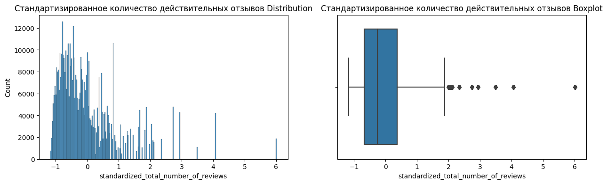
        * признак 'total_number_of_reviews'
        
        * признак 'review_total_negative_word_counts'
        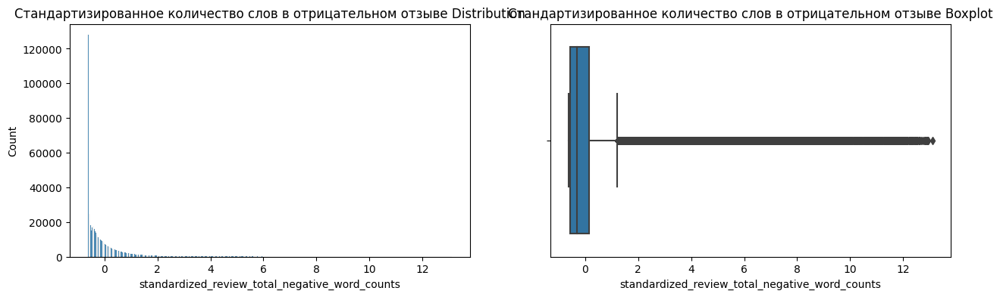
        * признак 'review_total_positive_word_counts'
        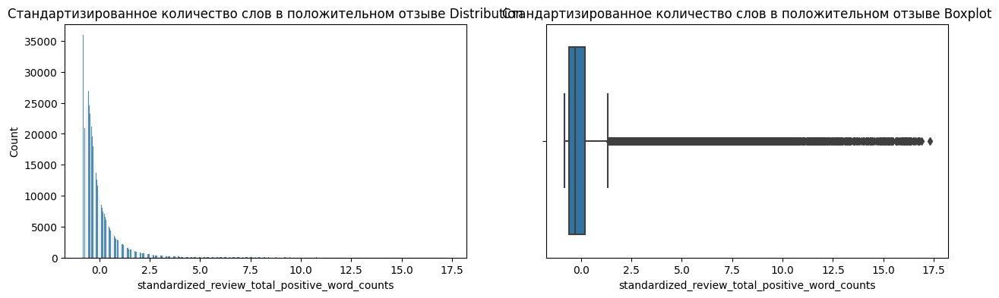
        * признак 'total_number_of_reviews_reviewer_has_given'
        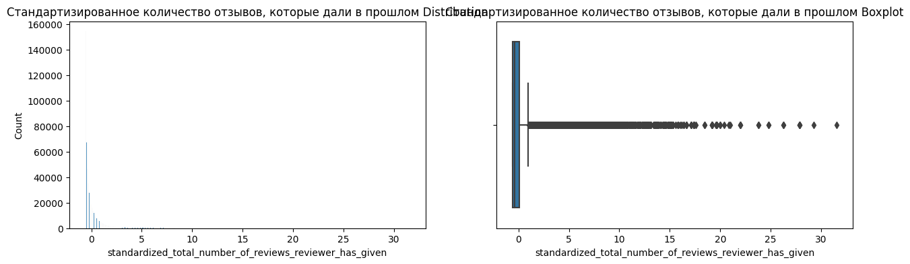

5. РАЗВЕДЫВАТЕЛЬНЫЙ АНАЛИЗ ДАННЫХ
    * Создание новых признаков
        *  Признак 'negative_review'
            * Создание новых признаков, это конечно максимально увлекательное мероприятие, начнем с того, что признак 'negative_review', хранит в себе отзывы и отзывы очень ценны сами по себе, так как каждый человек высказывает свою точку зрения и испытывает при этом определенную эмоцию, такую как положительную, отрицательну и нейтральную.
            * Построив первый раз признак, я увидел, что признак не несет в себе особоую полезную связь, поэтому я решил категоризировать не только эмоции, но и дополнительно покатели по типу такие как проблемы с едой, гостинецей, окружающей средой, ценой и бред.
        * Признак 'positive_review'
            * По такой же логике я прохожусь и с признаком 'positive_review'
        * Признак 'mean_posi_neg'
            * Далее я решил объединить два категориальных признака, усредних их между собой.
            * ДА, я понял, что это была пустая траты времени, так как ничего хорошего из этого не вышло
    * Разделение существующих признаков
        * признак 'hotel_address'
            * Знаю, что в адресе храниться индекс, улица, страна и город. Когда отдельно создавал 4 признака, увидил, что ничего полезного из этого не выходит, поэтому оставляю страна - город, как отдельный самостоятельный признак
            * Смотрю на зависимость признака
            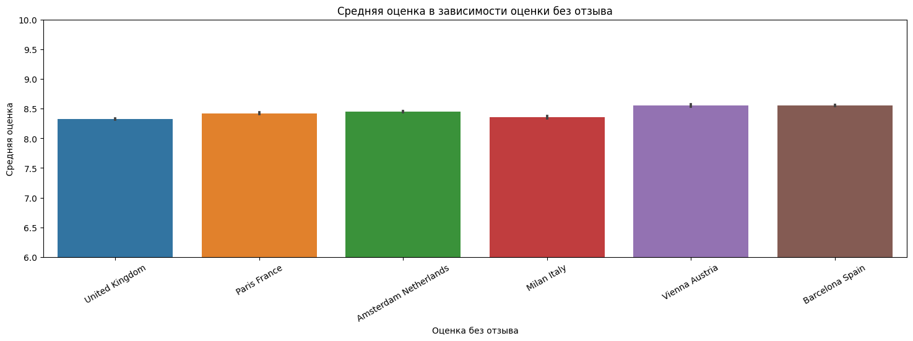
            Какой-то явной зависиомости тут нет.
        * признак 'tags'
            * Один из самых удобных признаков¶
            * В этом признаке храниться такая информация как вид поездки, отправка отзыва через устройство, статус гостя, количество прожитых ночей в гостинице, далее количество и вид комнат в номере
        *  признак 'trip'
            * Начнем с самого часто встречающегося - вида поездки.
            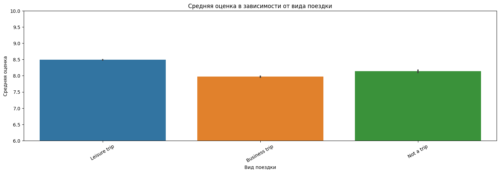
            Тип поездки плюс минус у всех одинаковый, ну может чуть больше у тех людей, которые приехали в отпуск
        * признак 'mobile'
            * Создаем признак по способу отправки отзыва, через мобильное или не мобильное устройство
            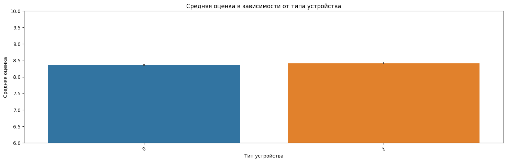
            Данный признак кажется не интересный для модели, так как значение очень схожи
        * признак 'guest_stat'
            * Создаем признак который условно называем статусом гостя
            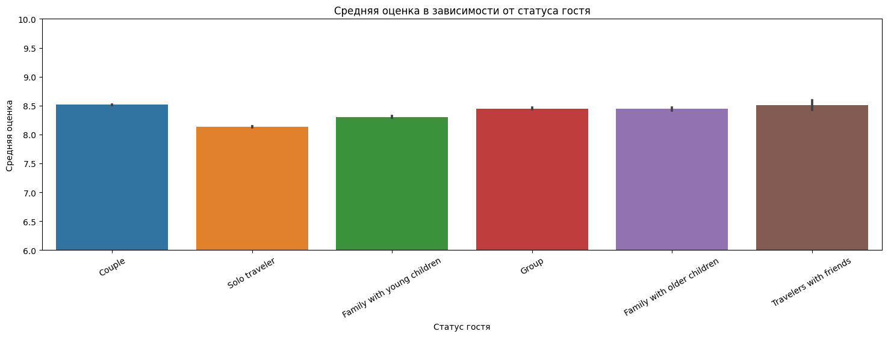
            И этот признак, особо не вызывает интереса, хотя можно выделить те группы, где два и более человек ехали одновременно
        * признак 'night_quantity'
            * Создаем признак количество ночей проживания
            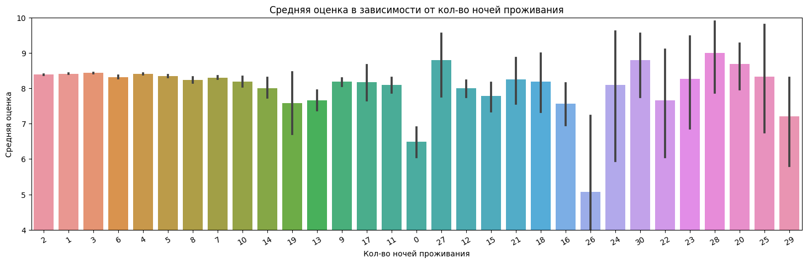
            Я думаю, что этот признак с количеством ночей, будет куда более интересен, так как на графике видны различного рода перепады.
        * признак 'rooms'
            * Создаем признак характеристика комнаты
            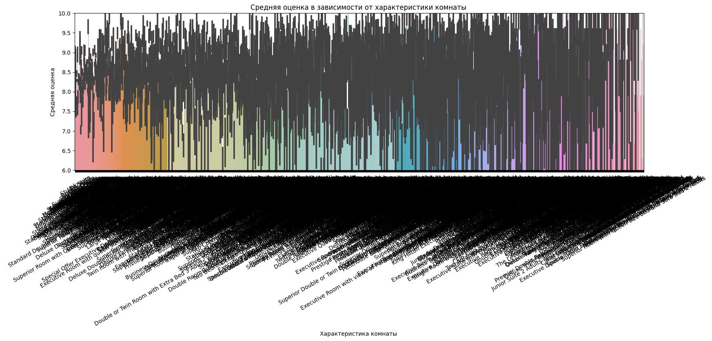
            Что тут можно сказть - какая-то каша, но это и классно. Признак очень интересный :)
        * Разбор признака 'review_date
            * Перевожу существующий признак времени во все возможные форматы дат для определения зависимости
        * признак 'day'
            * 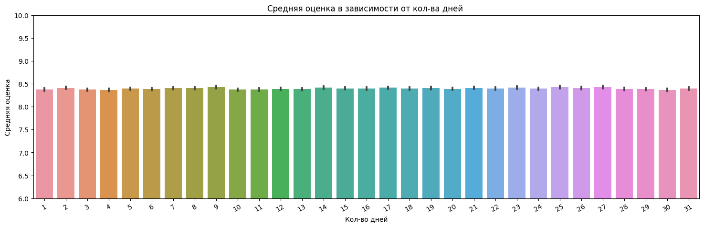
            Тут все выглядит неинтересно
        *  признак 'month'
            * 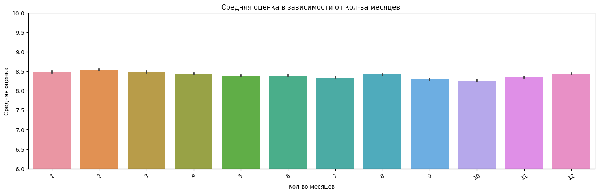
            Тут хоть какие-то перепады видны
        * признак 'year'
            * 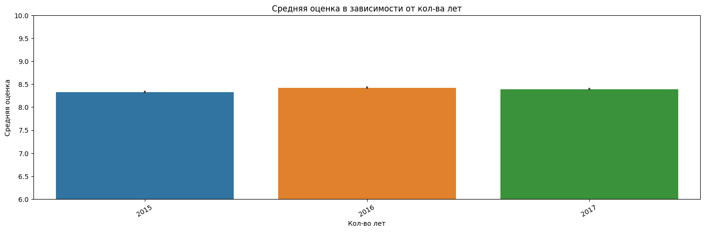
            Думаю, что не интересный признак
        * признак 'dayofweek'
            * 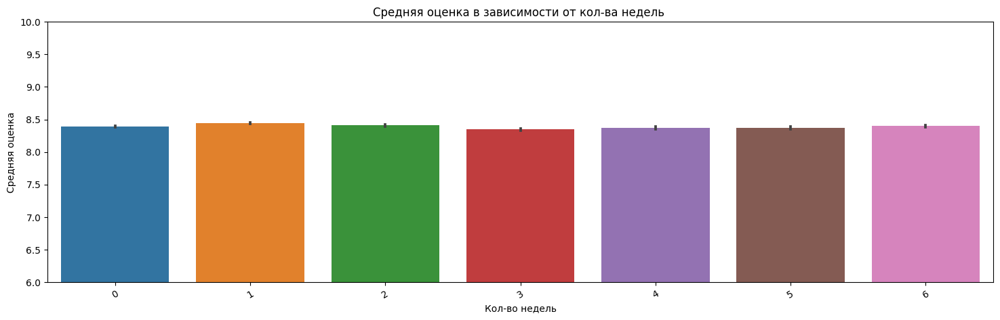
            Даты смотрю,все не интересные
        * Разбор признаков типа 'object'
            * Пробую создать новые признаки методом пересчета символов и количеством слов. Для анализу беру признаки типа 'object'
        * Признак 'word_count_negative'
            * 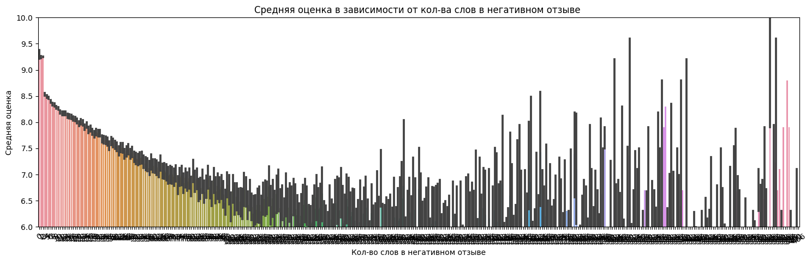
            Чудесный график, который может быть полезным для модели. Уверен, что тут есть выбросы, поэтому по привичному методу буду их стандартизировать
            * 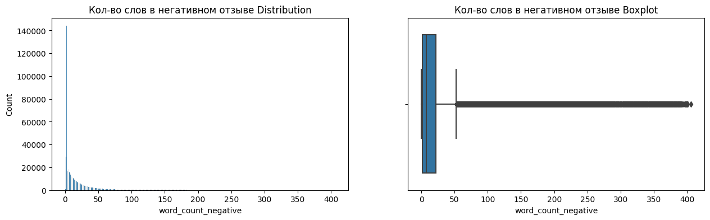
            Как и ожидалось выбросов тут достаточно, поэтому и стандартизирую
        * Признак 'word_count_positive'
            * 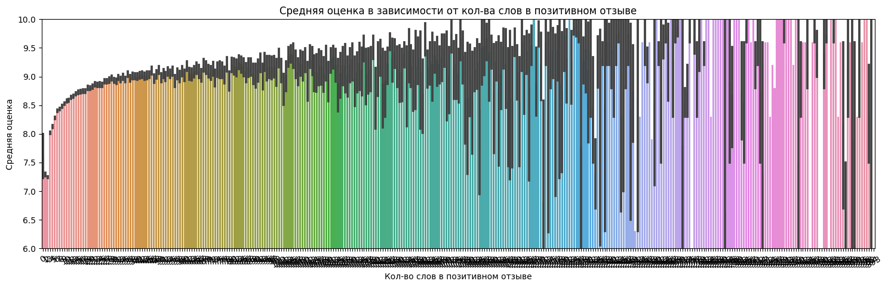
            Чудесный график, уверен, что он тоже будет нести полезную информазицю для модели
            * 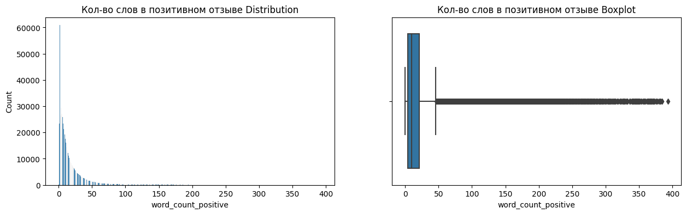
            Конечно,я проверил его на выбросы и стандартизировал
        * Признак 'word_count_hotel_name'
            * 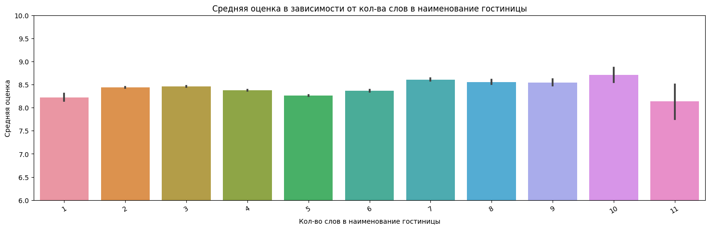
            Странный признак, но он имеет свою определенную ценность, поэтому берем его в оборот
        * Признак 'word_count_hotel_address'
            * 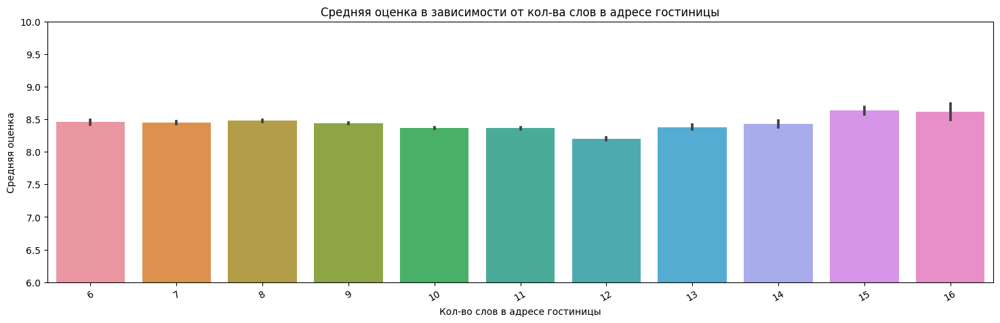
            Адрес гостиницы, тоже куда более интересней смотриться, чем те же самые даты
        * Признак 'word_count_rooms'
            * 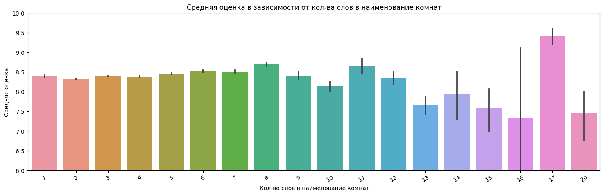
            Ну вот, перепады - здорово. Берем для обчения!
        * Признак 'char_count_negative'
            * 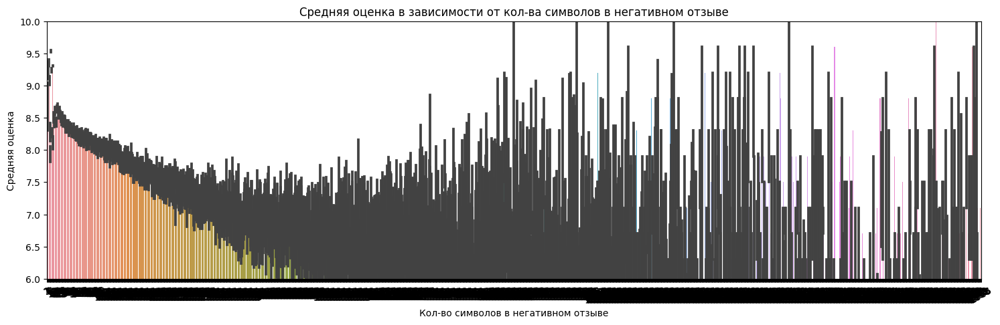
            Ох уж эта странная красота.
            * 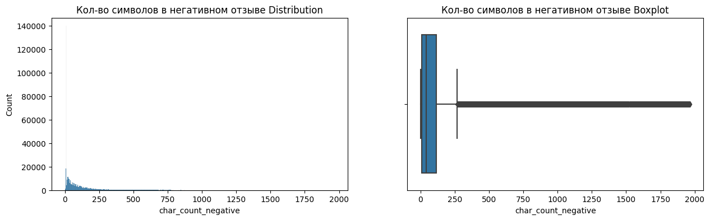
            ДА-ДА, все такие страшные вещи я буду стандартизировать!!!
        * Признак 'char_count_positive'
            * 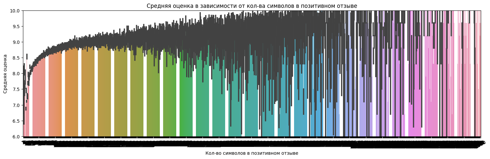
            Чудесненько
            * 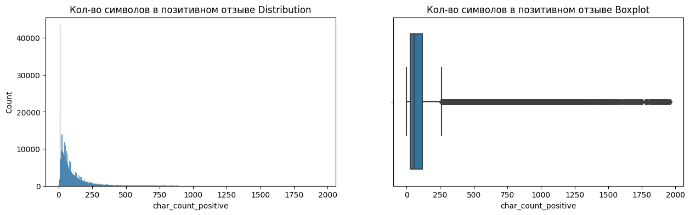
            И это я стандартизирую
        * Признак 'char_count_hotel_name'
            * 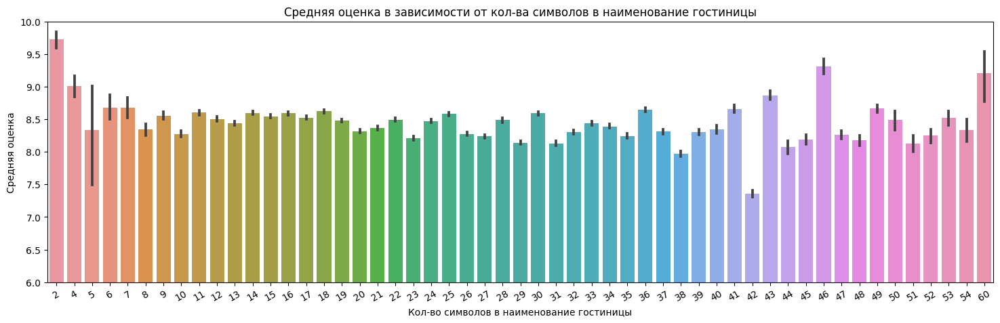
            Признак с наименованием гостиниц еще красочней раскрылся
        * Признак 'char_count_hotel_address'
            * 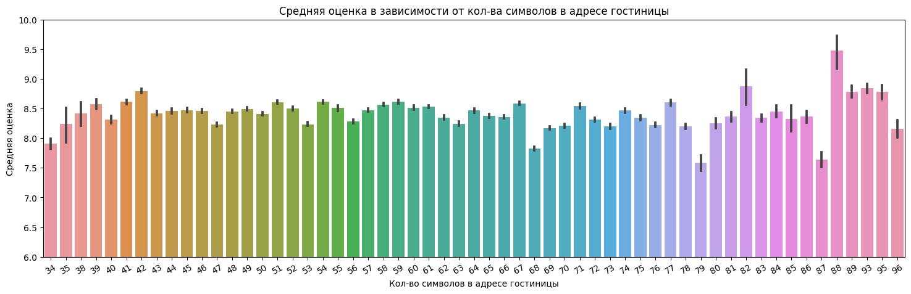
            И Адреса гостиниц, теперь выглядят куда более полезней
        * Признак 'char_count_rooms'
            * 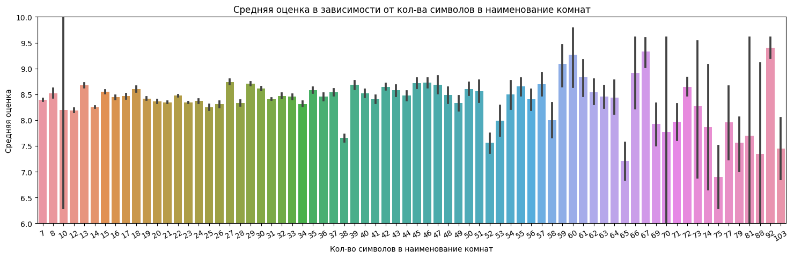
            Комнаты в гостинице теперь тоже выглядят прекрасно
        * Признак 'days_since_review'
            * В данном признаке есть слова и цифры, разделю по слову и вытаскиваю только число
            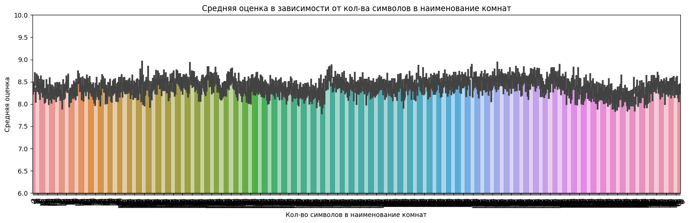
        * Опять признак rooms
            * Оказывается если признаку присвоить уникальное число, то на обучение столбец смотриться привлекательно
            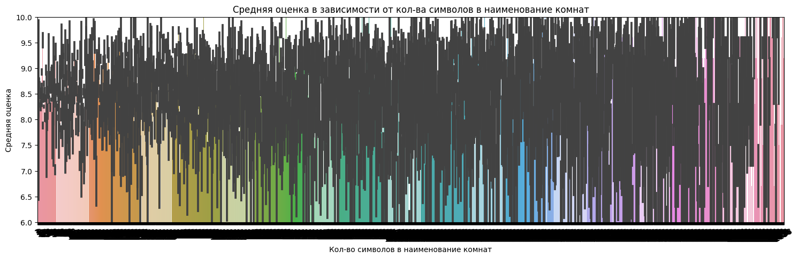
        * Признак 'night_quantity'
            * Тут просто меняю тип данных. Странно, что он изночально не поменялся сам

6. ЭТАП МОДЕЛИРОВАНИЯ И ВЫВОДА МОДЕЛИ В ПРОДАКШЕН
    * Кодирование признаков
        * encoder = ce.OneHotEncoder(cols=['country'], use_cat_names=True)
        * encoder = ce.OneHotEncoder(cols=['trip'], use_cat_names=True)
        * encoder = ce.OneHotEncoder(cols=['guest_stat'], use_cat_names=True)
        * Это позволит мне иметь уникальные признаки с наличием каждого под признака со своим значение  в виде бинарного ответа 
    * Данные подводим к продакшену
        * оставляю только числовые признаки
        * строю первичный график по возможной значимости признаков 
        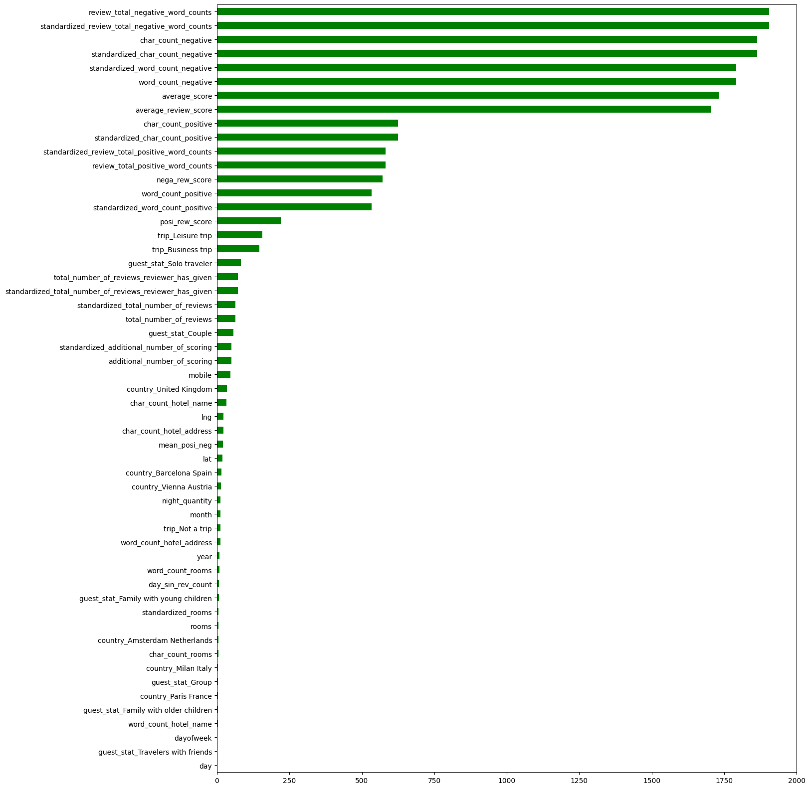
        * определею признаки с высокой корреляцией 
        * удаляю ненужыне признаки
    * Обучаем модель 
        * MAPE: 0.9086750946859526
        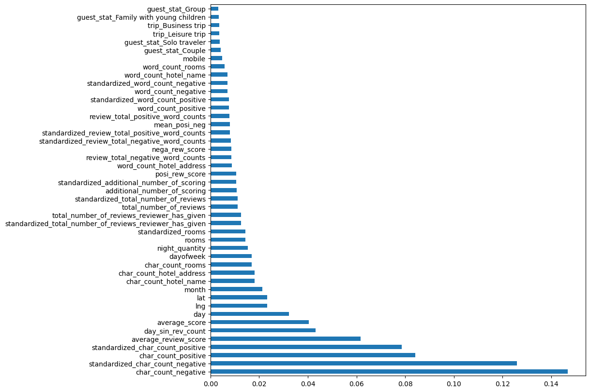
    * Отправляем данные
        
7. Вывод:
    * скажу честно, лично разработанные признаки, дали меньше результата, чем тупой про счет слов и символов
    * признаки, которые имеют высокую коррелицию их как будто тоже можно оставить, так как модель они не портят
    * я хочу оставить все как есть, так как это мой первый опыт и я считаю, что достаточно много получил для себя инсайтов. Далее я буду пробовать еще лучше разбирать каждый признак

### Ссылка на репозиторий

Для просмотра кода, предлагаю перейти по сслыкам. 

1. [Ссылка на git hub](https://github.com/qv1k1/I_Win/blob/main/02%20%D0%9F%D1%80%D0%BE%D0%B5%D0%BA%D1%82%D1%8B/project_6/version-32-07-04-24.ipynb)
2. [Ссылка на colab](https://colab.research.google.com/drive/1K3dD6QGTtGsna0ZPSRRoikkrmsKrA1IC?usp=sharing)
3. [Ссылка на kaggle](https://www.kaggle.com/code/gonaspect/version-32-07-04-24)

### Выводы

> Вся работа была разбита на 7 блоков:
* Импорт библиотек;
* ПОСТАНОВКА ПРОБЛЕМЫ;
* СБОР ДАННЫХ ;
* ОЧИСТКА ДАННЫХ;
* РАЗВЕДЫВАТЕЛЬНЫЙ АНАЛИЗ ДАННЫХ;
* ЭТАП МОДЕЛИРОВАНИЯ И ВЫВОДА МОДЕЛИ В ПРОДАКШЕН;
* Вывод. 

В первом блоке мы импортировали библиотеки, которые использовались в процессе работы для более корректного анализа данных;

Во втором блоке знакомства с данными и обозначение проблемы;

В третьем блоке объедение таблиц, знакомства, удаление дубликатов и заполнение пропусков; 

В-четвертом блоке, работа с выбрасами и создание признаков за счет метода стандартизации;

В пятом блоке креативно создавал признаки, путем изучение каждого признака и вытаскивания из него полезной информации; 

В шестом блоке данные подогнал под условие, а именно оставил только числовые признакми, а также запустил программу на расчет модели;

В-седьмом блоке, отображены выводы по каждому вопросу. 

Работа проделана большая, и анализ данных может быть полезен для сайта Booking.

[К оглавлению](README.md#оглавление)