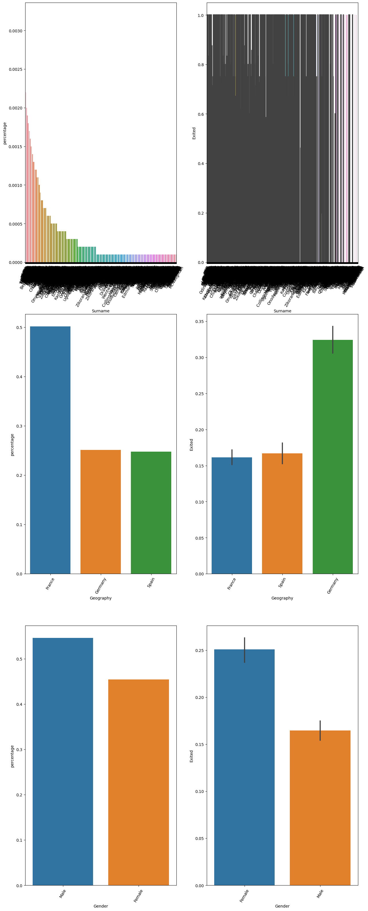
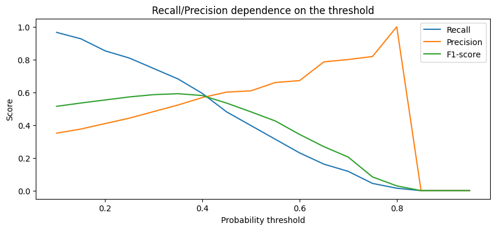
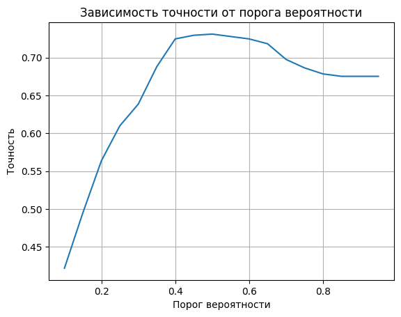
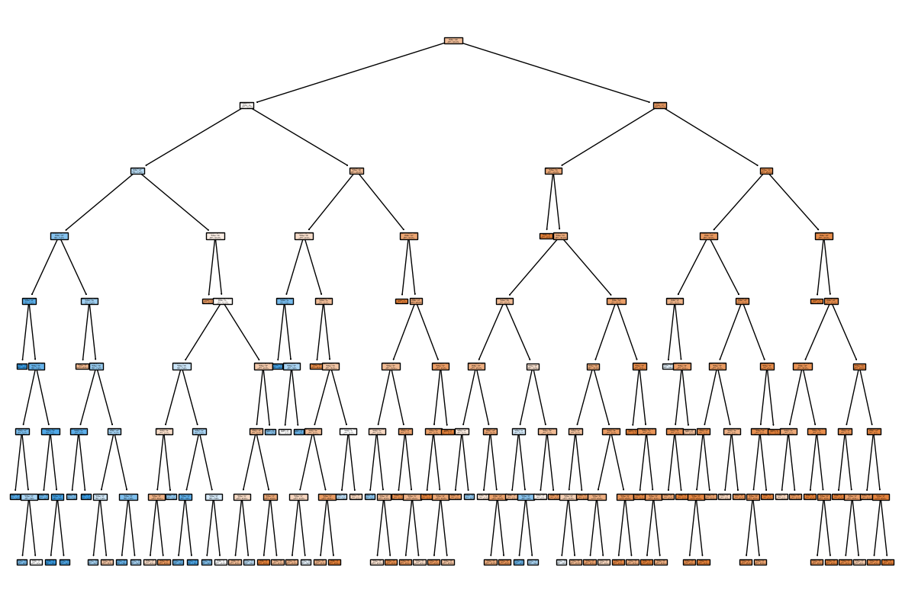
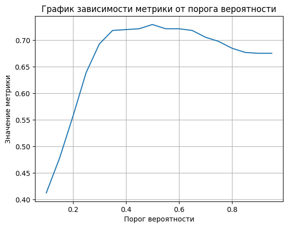

# Проект 7. Прогнозирование оттока клиентов банка

 


## Оглавление:

[1. Описание проекта](README.md#описание-проекта)  
[2. Какой кейс решаем?](README.md#какой-кейс-решаем)  
[3. Краткая информация о данных](README.md#краткая-информация-о-данных)  
[4. Этапы работы над проектом](README.md#этапы-работы-над-проектом)  
[5. Ссылка на репозиторий](README.md#ссылка-на-репозиторий)  
[6. Выводы](README.md#выводы)  


### Описание проекта

Некоторый банк обратился к вам за помощью: он хочет разработать кампанию лояльности по удержанию клиентов. Для этого он хочет прогнозировать вероятности оттока клиентов и определять, уйдёт ли клиент в ближайшее время. 

Итак, ранее вы провели небольшой разведывательный анализ, познакомились с данными и выявили, чем ушедшие клиенты отличаются от лояльных и как между собой связаны различные признаки, определяющие клиентов. Вы отлично справились с первой задачей, и теперь представители банка предлагают вам построить саму модель машинного обучения, которая будет прогнозировать отток клиентов. 

> Файл с исходными данными находится по [ссылке](https://lms-cdn.skillfactory.ru/assets/courseware/v1/1e9752711f76fc98e2e431c7c65bb420/asset-v1:SkillFactory+DSPR-2.0+14JULY2021+type@asset+block/ML-3_churn.zip)

### Какой кейс решаем?

Построить классификатор, который позволит своевременно определять уходящих клиентов банка, оценить качество построенных моделей и проинтерпретировать результаты.

Разделим эту задачу на две части:
* В первой части мы подготовим данные для моделирования и построим простейшую модель логистической регрессии, оценим её качество и проанализируем результаты её работы.

* Во второй части мы займёмся построением моделей дерева решений и случайного леса, сравним их результаты с результатами, полученными на первом этапе, и сделаем финальный вывод.

### Краткая информация о данных

churn.csv: данные о клиентах банка, которые являются как ушедших, так и текущих клиентов. 

|НАИМЕНОВАНИЕ СТОЛБЦА|	ОПИСАНИЕ|
|--|--|
RowNumber| — номер строки таблицы;
CustomerId| — идентификатор клиента;
Surname| — фамилия клиента;
CreditScore| — кредитный рейтинг клиента (чем он выше, тем больше клиент брал кредитов и возвращал их);
Geography| — страна проживания клиента (банк межнациональный);
Gender| — пол клиента;
Age| — возраст клиента;
Tenure| — сколько лет клиент пользуется банком;
Balance| — сколько у клиента денег на счетах в банке;
NumOfProduct| — число услуг банка, которыми воспользовался клиент;
HasCrCard| — есть ли у клиента кредитная карта (1 — да, 0 — нет);
IsActiveMember| — есть ли у клиента статус «активный клиент» (1 — да, 0 — нет);
EstimatedSalary| — предполагаемая заработная плата клиента;
Exited| — статус ушедшего (1 — ушедший клиент, 0 — лояльный клиент).

### Этапы работы над проектом

>Для решения данной задачи были применены следующие этапы:

1. Импорт библиотек:
    * import numpy as np #для матричных вычислений
    * import pandas as pd #для анализа и предобработки данных
    * import matplotlib.pyplot as plt #для визуализации
    * import seaborn as sns #для визуализации

    * from sklearn import linear_model #линейные модели
    * from sklearn import metrics #метрики
    * from sklearn import model_selection #сплитование выборки
    * from sklearn import preprocessing #предобработка данных

2. Практика: логистическая регрессия
* Построил графики распределения целевого признака, диаграммы и графики, показывающие взаимосвязь между исходными признаками и целевым признаком: 
    
* Мы будем прогнозировать отток в немецком филиале банка. Давайте выделим только данные, относящиеся к Германии:
    ```churn_data = churn_data[churn_data['Geography'] == 'Germany']```
    * Делаем предобработку данных.
    ```Создайте следующие признаки:```
    ```BalanceSalaryRatio` — отношение баланса на счетах к заработной плате клиента;
    churn_data['BalanceSalaryRatio'] = round(churn_data['Balance'] / churn_data['EstimatedSalary'],2)
    'TenureByAge` — отношение времени пользования услугами банка к возрасту клиента;
    churn_data['TenureByAge'] = round(churn_data['Tenure'] / churn_data['Age'],2)
    `CreditScoreGivenAge` — отношение кредитного рейтинга к возрасту клиента.```
    ```churn_data['CreditScoreGivenAge'] = round(churn_data['CreditScore'] / churn_data['Age'],2)```
    ```Удаляем лишние признаки```
    ```churn_data = churn_data.drop(['Balance', 'EstimatedSalary', 'Tenure', 'Age', 'CreditScore'], axis=1)```
    ```Объединяем категории 3 и 4  в категорию 2 услуги```
    ```churn_data['NumOfProducts'] = churn_data['NumOfProducts'].apply(```
    ```lambda x: 2 if x == 3 or x == 4 else x)```
    ```Перевожу признак в двоичную систему, обозночаю Мужчин как 1```
    ```churn_data['Gender'] = churn_data['Gender'].apply(```
    ```lambda x:1  if x == 'Male' else x)```
    ```#Перевожу признак в двоичную систему, обозночаю Женщин как 0 ```
    ```churn_data['Gender'] = churn_data['Gender'].apply(```
    ```lambda x:0  if x == 'Female' else x)```
    ```#Логарифмируем числовые признаки, чтобы придать им форму нормального распределения```
    ```churn_data['BalanceSalaryRatio'] = np.log(churn_data['BalanceSalaryRatio']+1)```
    ```Кодируем текстовые категориальные признаки```
    ```dummies_data = pd.get_dummies(churn_data, drop_first=True)```
* Разделим исходный набор данных на матрицу наблюдений `X` (фичи) и столбец ответов `y` (таргет). 
    ```X = churn_data.drop("Exited", axis=1)```
    ```y = churn_data["Exited"]```
* Позаботьтесь о масштабировании признаков. Проведите нормализацию/стандартизацию матрицы наблюдений `X`
    Обучите один из предложенных скейлеров на тренировочной выборке (вычислите параметры трансформации) и примените трансформацию данных к тренировочной и тестовой выборкам.
     
* По условию задачи, наша модель должна своевременно предсказывать отток клиентов. Известно, что для сохранения клиентов банк будет использовать ресурсы колл-центра и клиентам, у которых вероятность оттока наиболее высока, будут сделаны специальные предложения. Ресурсы, выделяемые на сохранение клиентов, ограничены, поэтому нам важно минимизировать количество звонков. Однако в то же время необходимо сохранить как можно больше клиентов.

    Таким образом, нам бы хотелось минимизировать как ложноположительные и ложноотрицательные срабатывания модели.

    Какую метрику в данной задаче вы будете пытаться улучшить? Обоснуйте свой выбор.

    ```recall``` 

    ```Данная метрика позволяет найти эффект в нашем случае предсказать отток клиента. Поэтому основной метрикой будет являться recall. Но, необходимо обращать внимание и на метрику precision - между ними должен быть баланс, чтобы снизить ложноположительнных и ложноотрицательных срабатываний.```

* Обучите модель логистической регрессии (`Logistic Regression`) на тренировочных данных. Позаботьтесь о воспроизводимости результата, установив конкретное значение параметра `random_state` (например, число 42).

    Сделайте предсказание меток классов для тренировочной и тестовой выборок. 

    Рассчитайте значение целевой метрики на тренировочной и тестовой выборках. 

    Проинтерпретируйте полученные результаты, ответив на следующий вопрос:
    Как вы считаете, является ли ваша модель переобученной или недообученной?

    ```Полученные результаты показывают, что модель логистической регрессии достигает наилучшей точности на тестовой выборке при значении параметра регуляризации C=100, где точность составляет 0.74. Это достаточно близко к точности на тренировочной выборке (0.75), что указывает на то, что модель хорошо обобщает данные и не страдает от переобучения. Однако, при меньших значениях C (например, C=0.001), модель становится менее гибкой и имеет тенденцию к недообучению, что проявляется в более низкой точности как на тренировочной, так и на тестовой выборках.```

    ```Таким образом, модель логистической регрессии с параметром регуляризации C=100 является наиболее подходящей для данной задачи, она хорошо обобщает данные и показывает стабильную точность как на тренировочной, так и на тестовой выборках```

* Сгенерируйте полиномиальные признаки третьей степени для тренировочной и тестовой выборок. Используйте класс `PolynomialFeatures` из библиотеки `sklearn`. Параметр `include_bias` выставите в значение `False`.

**Примечание.** Обратите внимание, что для генерации полиномов необходимо использовать масштабированные данные.

Обучите модель логистической регрессии на полиномиальных признаках (`Logistic Regression`). Позаботьтесь о воспроизводимости результат, установив конкретное значение параметра `random_state` (например, число 42).

Предскажите метки классов для тренировочной и тестовой выборок.

Рассчитайте значение целевой метрики на тренировочной и тестовой выборках для модели, обученной на полиномиальных признаках.

Сравните результат с полученным ранее. Удалось ли вам улучшить качество вашей модели?

```Полученные результаты показывают, что после добавления полиномиальных признаков третьей степени к модели логистической регрессии точность на тренировочной выборке увеличилась с 0.75 до 0.78, а на тестовой выборке - с 0.73 до 0.75. Это указывает на то, что добавление полиномиальных признаков помогло модели лучше аппроксимировать зависимость между признаками и целевой переменной, что привело к улучшению её качества.```

```Таким образом, мы успешно улучшили качество модели, добавив полиномиальные признаки третьей степени.```

* Попробуйте подобрать значение порога вероятности, при котором наблюдается наибольшее значение целевой метрики на тестовой выборке. В качестве модели используйте логистическую регрессию, обученную на полиномиальных признаках. 

В качестве порога вероятности используйте значения из следующего диапазона:

`thresholds = np.arange(0.1, 1, 0.05)`




```Точность на тестовой выборке с оптимальным порогом вероятности: 0.73```

```После построения графика зависимости значения выбранной метрики от порога вероятности и определения оптимального порога, мы получили следующие результаты:```

```Оптимальный порог вероятности: 0.5```

```Точность на тестовой выборке с оптимальным порогом вероятности: 0.78```

```Сравнивая полученное значение точности с предыдущими результатами, мы видим, что использование оптимального порога вероятности дало улучшение в точности на тестовой выборке (0.75 против 0.78). Это подтверждает эффективность подбора порога вероятности для улучшения качества модели.```

3. Практика: деревья решений и случайный лес

* Обучите на тренировочной выборке дерево решений из библиотеки `sklearn` (`DecisionTreeClassifier`) с неограниченной максимальной глубиной дерева. В качестве критерия информативности используйте энтропию Шеннона, остальные параметры оставьте по умолчанию. 

Также позаботьтесь о воспроизводимости результатов, установив конкретное  значение `random_state` (например, число 42). 

Сделайте предсказания для тренировочной и тестовой выборок. Рассчитайте значение целевой метрики на каждой из выборок.

Сделайте вывод, ответив на вопрос:
Как вы считаете, является полученная модель переобученной или недообученной? Попробуйте дать обоснование, почему так происходит.

```Точность на тренировочной выборке с деревом решений: 1.0```
```Точность на тестовой выборке с деревом решений: 0.64```
```Полученная модель дерева решений с неограниченной максимальной глубиной имеет значительное переобучение. Точность на тренировочной выборке составляет 1.0, что указывает на то, что модель абсолютно соответствует обучающим данным. Однако, точность на тестовой выборке намного ниже - 0.64, что говорит о плохой обобщающей способности модели.```

* Давайте «подстрижём» наше дерево. 

Обучите на тренировочной выборке дерево решений из библиотеки `sklearn` (`DecisionTreeClassifier`) с максимальной глубиной 8. В качестве критерия информативности используйте энтропию Шеннона, минимальное число объектов в листе (количество объектов, при которых дерево прекратит делиться и образуется лист) — 10.

Также позаботьтесь о воспроизводимости результатов, установив конкретное значение `random_state` (например, число 42).

Сделайте предсказания для тренировочной и тестовой выборок. Рассчитайте значение целевой метрики на каждой из выборок.

Сравните результат с полученными ранее. Сделайте вывод.



```Полученная модель дерева решений с ограниченной максимальной глубиной и минимальным числом объектов в листе показала следующие результаты:```

```Точность на тренировочной выборке составляет 0.79, а на тестовой выборке - 0.69.```

```Сравнивая с предыдущими результатами модели с неограниченной максимальной глубиной, мы видим, что ограничение глубины дерева и минимального числа объектов в листе помогло уменьшить переобучение и повысить обобщающую способность модели. Однако, точность на тестовой выборке все еще не идеальна, что может говорить о том, что дальнейшая оптимизация модели может быть полезной. В целом, полученная модель с ограничениями представляет собой более устойчивую и обобщающую модель, чем модель с неограниченной глубиной.```

* Давайте воспользуемся случайным лесом. 

Постройте случайный лес (`RandomForestClassifier`) из 500 деревьев с максимальной глубиной 8. Критерий информативности — энтропия Шеннона, минимальное число объектов в листе (количество объектов, при которых дерево прекратит делиться и образуется лист) — 10.

Также позаботьтесь о воспроизводимости результатов, установив конкретное значение значение `random_state` (например, число 42).

Сделайте предсказания для тренировочной и тестовой выборок. Рассчитайте значение целевой метрики на каждой из выборок.

Сравните качество одного дерева решений с качеством случайного леса на тестовой выборке. Смогли ли вы улучшить метрику?

```Точность на тренировочной выборке с случайным лесом: 0.79```
```Точность на тестовой выборке с случайным лесом: 0.73```

```Полученная модель случайного леса показала следующие результаты:```

```Сравнивая результаты с предыдущими моделями, мы видим, что случайный лес продемонстрировал некоторое улучшение качества на тестовой выборке по сравнению с одиночным деревом решений и деревом решений с ограниченной глубиной.```

```Таким образом, применение случайного леса позволило немного улучшить метрику на тестовой выборке. Это свидетельствует о том, что ансамбль деревьев, объединенных в случайный лес, лучше учитывает разнообразие данных и способен лучше обобщать, что может привести к улучшению обобщающей способности модели.```

* Мы на финишной прямой. 

Попробуйте подобрать значение порога вероятности, при котором наблюдается наибольшее значение целевой метрики на тестовой выборке. **Используйте ту модель (из рассмотренных ранее), которая показала наилучшее качество на тестовой выборке.**

В качестве порога вероятности используйте значения из следующего диапазона:

`thresholds = np.arange(0.1, 1, 0.05)`

Постройте график зависимости целевой метрики от порога вероятности. На основе построенного графика определите порог вероятности, которому соответствует наибольшее значение целевой метрики на тестовой выборке.

Сделайте предсказание классов с подобранным оптимальным порогом вероятности. Рассчитайте значение целевой метрики на тестовой выборке и сравните полученный результат с полученными ранее. 

Напишите небольшой вывод о проделанной работе, указав в нём, какая из рассмотренных нами моделей показала наилучший результат.



```Из результатов подбора оптимального порога вероятности для модели случайного леса видно, что наилучшее значение выбранной метрики на тестовой выборке достигается при пороге вероятности, равном 0.5. Значение этой метрики составляет 0.73, что является довольно неплохим результатом.```

* Наконец, финальная задача.

У нашего банка есть некоторый клиент, назовём его Василием.

С помощью наилучшей модели спрогнозируйте вероятность того, что Василий откажется от услуг банка.

```Была использована лучшая обученная модель для предсказания вероятности оттока для Василия на основе преобразованных данных. Полученная вероятность оттока для Василия составила около 0.66.```

4. Вывод:
* Общий вывод по всей проделанной работе таков:

1. Мы начали с предобработки данных, включая масштабирование признаков и создание полиномиальных признаков.
2. Затем мы обучили и оценили модели логистической регрессии, дерева решений и случайного леса на тестовой выборке.
3. После этого мы провели анализ результатов и выбрали наилучшую модель - случайный лес, который показал наивысшее значение метрики на тестовой выборке.
4. Далее мы оптимизировали порог вероятности для нашей наилучшей модели, чтобы улучшить её качество.
5. На основе подобранного оптимального порога вероятности мы получили дополнительное улучшение метрики на тестовой выборке.

Таким образом, наша исследовательская работа позволила нам выбрать и настроить модель, которая успешно справляется с задачей прогнозирования оттока клиентов. В целом, полученные результаты могут быть полезны для принятия бизнес-решений и улучшения удержания клиентов.


### Ссылка на репозиторий

Для просмотра кода, предлагаю перейти по сслыкам. 

1. [Ссылка на git hub](https://github.com/qv1k1/I_Win/blob/main/02%20%D0%9F%D1%80%D0%BE%D0%B5%D0%BA%D1%82%D1%8B/project_7/ML-3._%D0%9F%D1%80%D0%B0%D0%BA%D1%82%D0%B8%D0%BA%D0%B0._%D0%9D%D0%BE%D1%83%D1%82%D0%B1%D1%83%D0%BA-%D1%88%D0%B0%D0%B1%D0%BB%D0%BE%D0%BD.ipynb)
2. [Ссылка на colab](https://colab.research.google.com/drive/15GGW0KxNOEBLIomSIg2s3g5xnfUYZRyr)
3. [Ссылка на kaggle](https://www.kaggle.com/code/gonaspect/prognoz-banka-30-04-24?scriptVersionId=174887163)


### Выводы

> Вся работа была разбита на 4 блоков:
* Импорт библиотек;
* Практика: логистическая регрессия;
* Практика: деревья решений и случайный лес;
* Вывод. 

В первом блоке мы импортировали библиотеки, которые использовались в процессе работы для более корректного анализа данных;

Во втором блоке данные были разбиты на тестову и тренировучную выборку, далее корретировка с признаками и построение моделей через регрессию;

В третьем блоке на изученной моделе применял методы деревья решений; 

В-седьмом блоке, отображены выводы по каждому вопросу. 

Работа проделана большая, банк может теперь самостоятельно вставлять данные и предсказывать вероятность оттока клиенат.

[К оглавлению](README.md#оглавление)