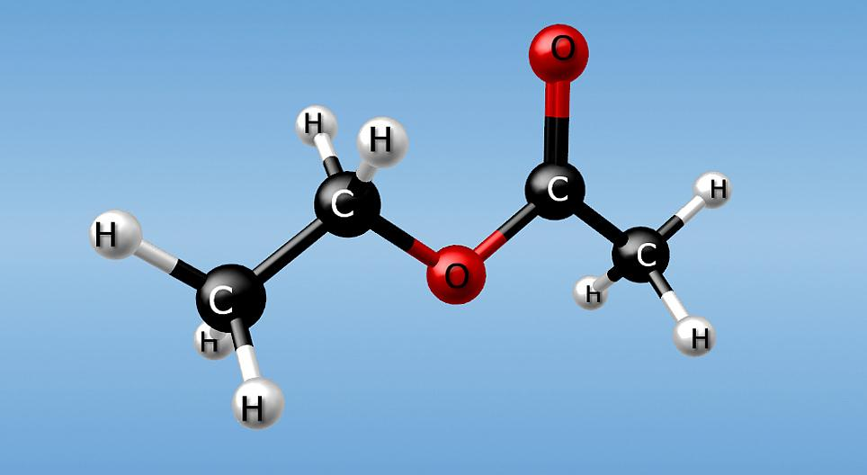
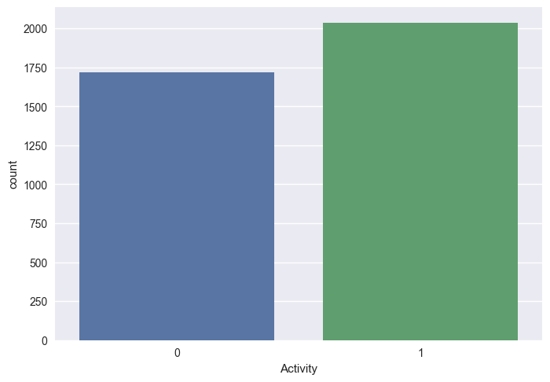
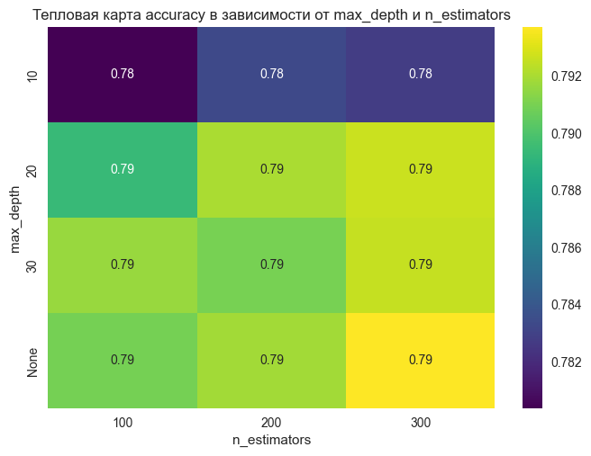
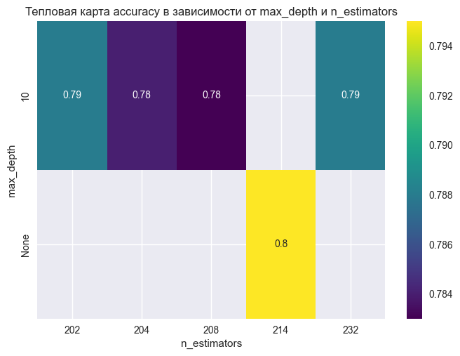
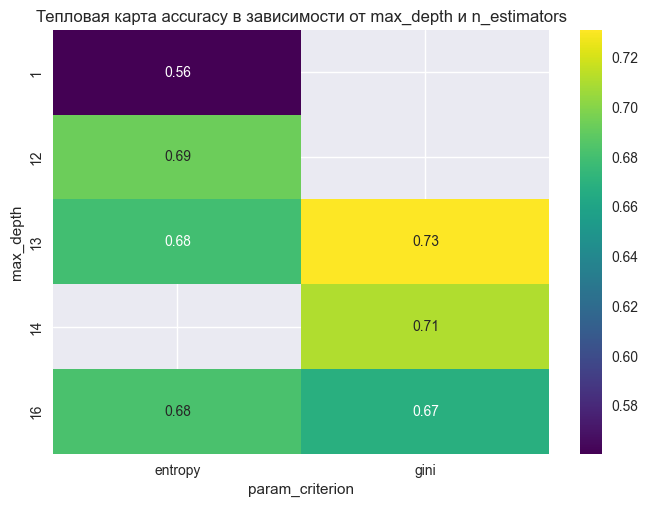
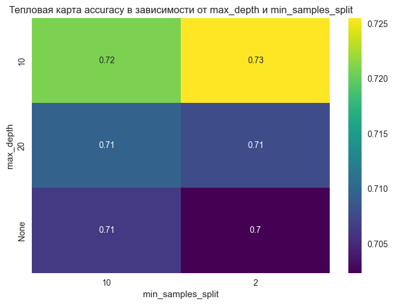
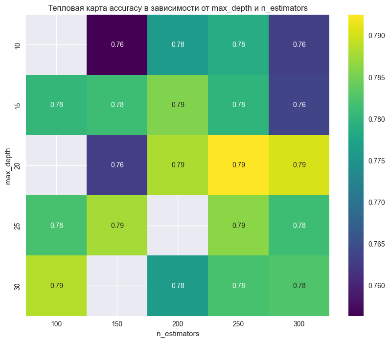

# Проект 9. Предсказывание биологических молекул по их химическому составу

## Оглавление:

[1. Описание проекта](README.md#описание-проекта)  
[2. Какой кейс решаем?](README.md#какой-кейс-решаем)  
[3. Краткая информация о данных](README.md#краткая-информация-о-данных)  
[4. Этапы работы над проектом](README.md#этапы-работы-над-проектом)  
[5. Ссылка на репозиторий](README.md#ссылка-на-репозиторий)  
[6. Выводы](README.md#выводы)  

### Описание проекта

Необходимо предсказать биологический ответ молекул (столбец 'Activity') по их химическому составу (столбцы D1-D1776).

Данные представлены в формате [CSV](https://lms-cdn.skillfactory.ru/assets/courseware/v1/9f2add5bca59f8c4df927432d605fff3/asset-v1:SkillFactory+DSPR-2.0+14JULY2021+type@asset+block/_train_sem09__1_.zip).  Каждая строка представляет молекулу. 

### Какой кейс решаем?

Предварительная обработка не требуется, данные уже закодированы и нормализованы.

В качестве метрики будем использовать F1-score.

Необходимо обучить две модели: логистическую регрессию и случайный лес. Далее нужно сделать подбор гиперпараметров с помощью базовых и продвинутых методов оптимизации. Важно использовать все четыре метода (GridSeachCV, RandomizedSearchCV, Hyperopt, Optuna) хотя бы по разу, максимальное количество итераций не должно превышать 50.

### Краткая информация о данных

_train_sem09.csv: Данные представлены в формате CSV.  Каждая строка представляет молекулу. 

* Первый столбец Activity содержит экспериментальные данные, описывающие фактический биологический ответ [0, 1]; 
* Остальные столбцы D1-D1776 представляют собой молекулярные дескрипторы — это вычисляемые свойства, которые могут фиксировать некоторые характеристики молекулы, например размер, форму или состав элементов.

### Этапы работы над проектом

>Для решения данной задачи были применены следующие этапы:

#### 1. Импорт библиотек:

* import numpy as np  # для матричных вычислений
* import pandas as pd  # для анализа и предобработки данных
* import matplotlib.pyplot as plt  # для визуализации
* import seaborn as sns  # для визуализации
* import optuna  # для автоматической оптимизации гиперпараметров
* from sklearn import linear_model  # линейные модели
* from sklearn import tree  # деревья решений
* from sklearn import ensemble  # ансамбли моделей
* from sklearn import metrics  # метрики оценки
* from sklearn import preprocessing  # предобработка данных
* from sklearn.model_selection import train_test_split  # сплитование выборки
* from sklearn.model_selection import GridSearchCV  # поиск по сетке
* from sklearn.model_selection import RandomizedSearchCV  # случайный поиск
* from sklearn.model_selection import train_test_split, cross_val_score  # сплитование выборки и кросс-валидация
* from sklearn.tree import DecisionTreeClassifier  # классификатор на основе дерева решений
* from sklearn.ensemble import RandomForestClassifier  # классификатор на основе случайного леса
* from sklearn.metrics import accuracy_score, f1_score  # метрики точности и F1-метрики
* from scipy.stats import randint  # для генерации случайных чисел
* from hyperopt import hp, tpe, fmin, Trials, STATUS_OK  # для автоматической оптимизации гиперпараметров
* from hyperopt.pyll.base import scope  # для определения пространства поиска гиперпараметров
*  %matplotlib inline #Визуализация графиков в блокноте
* plt.style.use('seaborn')  # установка стиля графиков

#### 2. Практика: логистическая регрессия
* Построил график распределения целевого признака: 
    

#### 3. Логистическая регрессия
##### Модель - GridSearchCV
* accuracy на тестовом наборе: 0.80
* f1_score на тестовом наборе: 0.82

* **Вывод:** Наивысшая точность (0.80) достигается при max_depth=None и n_estimators=300. Это предполагает, что для данной модели и набора данных неограниченная глубина деревьев и большое количество деревьев дают наилучший результат.

##### Модель - RandomizedSearchCV
* accuracy на тестовом наборе: 0.80
* f1_score на тестовом наборе: 0.83

* **Вывод:** Модель RandomForestClassifier с подобранными параметрами показала достаточно высокую точность и F1-метрику на тестовом наборе данных. Значение точности в 80% указывает на то, что 80% предсказаний модели были правильными. F1-метрика, равная 83%, также показывает хорошее качество предсказаний модели, учитывая баланс между точностью (precision) и полнотой (recall).

#### 4. Дерево решений
##### Модель - RandomizedSearchCV
* accuracy на тестовом наборе: 0.76
* f1_score на тестовом наборе: 0.78

* **Вывод:** При использовании случайного поиска с помощью RandomizedSearchCV для настройки параметров модели DecisionTreeClassifier произошло ухудшение метрик на тестовом наборе данных. Точность (accuracy) снизилась до 0.76, а F1-метрика до 0.78 по сравнению с предыдущими результатами.

##### Модель - GridSearchCV
* accuracy на тестовом наборе: 0.75
* f1_score на тестовом наборе: 0.75

* **Вывод**
* Текущая точность (accuracy) составляет 0.75, что немного ниже по сравнению с предыдущей (0.76).
* Текущий F1-score также составляет 0.75, что ниже предыдущего значения (0.78).

#### 5. Hyperopt
* Точность на тестовом наборе: 0.81
* F1-метрика на тестовом наборе: 0.80

* **Вывод:** Использование Hyperopt для оптимизации гиперпараметров привело к небольшой, но значимой улучшению производительности модели RandomForestClassifier по сравнению с предыдущими методами (GridSearchCV и DecisionTreeClassifier).

#### 6. Optuna
* Точность на тестовом наборе: 0.80
* F1-метрика на тестовом наборе: 0.80

* **Вывод:** Результаты показывают, что оптимизация гиперпараметров с использованием Optuna позволила достичь точности и F1-метрики на уровне 0.80 на тестовом наборе данных. Это свидетельствует о том, что подобранные гиперпараметры способствуют повышению производительности модели по сравнению с дефолтными настройками.

#### 7. Вывод:
* Таблица с данными

Модель| accuracy| f1_score
|--|--|--|
RandomForestClassifier - GridSearchCV | 0.80| 0.82
RandomForestClassifier - RandomizedSearchCV| 0.80| 0.83
DecisionTreeClassifier - RandomizedSearchCV | 0.76| 0.78
DecisionTreeClassifier - GridSearchCV | 0.75| 0.75
Hyperopt | 0.81 | 0.80
optuna | 0.80| 0.80

Основной  вывод:

* RandomForestClassifier с RandomizedSearchCV показал наилучшие результаты по F1-метрике (0.83):

Этот метод также показал высокую точность (0.80), что делает его предпочтительным выбором для задач, где важна точная классификация и балансировка классов.

* RandomForestClassifier с GridSearchCV также показал хорошие результаты:

Модель показала точность 0.80 и F1-метрику 0.82. GridSearchCV выполняет исчерпывающий поиск по пространству гиперпараметров, что приводит к хорошим результатам, но это может занять больше времени по сравнению с RandomizedSearchCV.

* Hyperopt продемонстрировал самую высокую точность (0.81):

Хотя F1-метрика немного ниже (0.80), использование Hyperopt для автоматической оптимизации гиперпараметров показало себя весьма эффективным.

* Optuna показала стабильные результаты:

Optuna продемонстрировала высокую точность (0.80) и F1-метрику (0.80), что делает её хорошим инструментом для оптимизации гиперпараметров, особенно учитывая её возможности для параллельной и распределённой оптимизации.

* DecisionTreeClassifier показывает более низкие результаты по сравнению с RandomForestClassifier:

RandomizedSearchCV для DecisionTreeClassifier показал точность 0.76 и F1-метрику 0.78, что выше, чем при использовании GridSearchCV (точность 0.75 и F1-метрика 0.75). Это подтверждает, что случайный поиск может быть более эффективным для деревьев решений.

### Ссылка на репозиторий

Для просмотра кода, предлагаю перейти по сслыкам. 

1. [Ссылка на git hub](https://github.com/qv1k1/I_Win/blob/main/02%20%D0%9F%D1%80%D0%BE%D0%B5%D0%BA%D1%82%D1%8B/project_9/ML-7.%20%20%D0%9F%D1%80%D0%B0%D0%BA%D1%82%D0%B8%D0%BA%D0%B0.ipynb)
2. [Ссылка на colab](https://colab.research.google.com/drive/1oesXokqTPusIf6gv0-vdlaphg4yKi8Bl?usp=sharing)

### Выводы

> Вся работа была разбита на 6 блоков:
* Импорт библиотек;
* Расчет модлей логистической регрессии;
* Расчет модели дерева решений;
* Расчет модели Hyperopt;
* Расчет модели Optuna;
* Вывод. 

В первом блоке мы импортировали библиотеки, которые использовались в процессе работы для более корректного анализа данных;

Со второго блока по пятый блок был произвден расчет модлей по собственным параметрам;

В шестом блоке, отображены выводы по каждому вопросу. 

Работа проделана большая, данные можно использовать для предсказывание биологических молекул по их химическому сосставу 

[К оглавлению](README.md#оглавление)